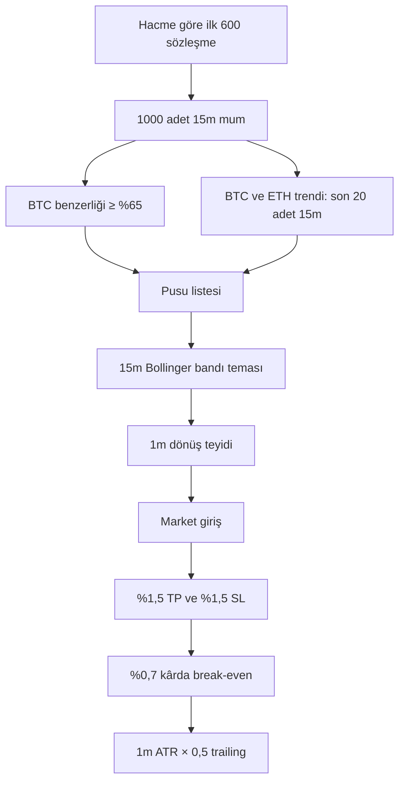

# GPTSONOEV — Son Soru ve Ayrıntılı Strateji Analizi

**İlk kayıt tarihi:** 28 Temmuz 2026  
**Son güncelleme:** 15 Ağustos 2026  
**Konu:** `.env` ayarlarının etkinliği, gerçek bot stratejisi, güvenlik geliştirmeleri, merkezi ENV yapılandırması, ağırlıklı piyasa trendi, bağımsız pusu izleme, ATR Telegram bildirimleri, R tabanlı kâr kilidi, paper/live takip eşitliği, PR #27 güvenli işlem akışı, PR #28 işlem kalitesi ile telemetri geliştirmeleri ve PR #29 market breadth giriş/risk kontrolleri

> **Kalıcı proje dosyası kuralı:** Bu projenin kanonik sürüm ve değişiklik
> günlüğü `versiyon güncelle.md` dosyasıdır. Proje kapsamındaki konuşmalarda
> “güncelle.md” denildiğinde bu dosya anlaşılır ve yeni PR kayıtları mevcut
> içerik korunarak bu dosyaya eklenir.

---

## Kullanıcı sorusu

`.env` dosyası bütün ayarları bastırır değil mi? `.env` dosyasının ayarlar ile ilgili kodların olduğu bölüm bu:

```env
############################################################
# TRADING PARAMETERS
############################################################

# İşlemlerde kullanılacak kaldıraç oranı.
LEVERAGE=2

# Her işlem için kullanılacak sabit USDT miktarı.
TRADE_SIZE_USDT=20

# Paper (sanal) işlem modunda başlangıç bakiyesi.
PAPER_WALLET_START_USDT=1000

# ATR (Average True Range) hesaplamasında kullanılacak mum periyodu.
ATR_PERIOD=14

# Break Even seviyesinin ATR katsayısı.
BE_ATR_MULTIPLIER=0.5

# Trailing Stop hesaplamasında kullanılacak ATR katsayısı.
TRAILING_ATR_MULTIPLIER=0.5

# Her TP güncellemesinde kullanılacak ATR katsayısı.
TP_STEP_ATR_MULTIPLIER=0.5

# TP artışının minimum yüzde değeri.
MIN_TP_STEP_PERCENT=0.5

# Aynı anda açılabilecek maksimum pozisyon sayısı.
MAX_POSITIONS=100

# Sideways piyasa tespitinde kullanılacak minimum ADX değeri.
SIDEWAYS_ADX_MIN=16

# Sideways analizinde kullanılacak hacim karşılaştırma mum sayısı.
SIDEWAYS_VOLUME_LOOKBACK=5

# Sideways analizinde kullanılacak EMA periyodu.
SIDEWAYS_EMA_PERIOD=7

# Break Even'in aktif olacağı minimum kâr yüzdesi.
BREAK_EVEN_TRIGGER_PERCENT=0.7

# İşlem açıldığında kullanılacak ilk Take Profit yüzdesi.
INITIAL_TP_PERCENT=1.5

# İşlem açıldığında kullanılacak ilk Stop Loss yüzdesi.
STOP_LOSS_PERCENT=1.5

############################################################
# SIMILARITY ENGINE (BÖLÜM 4)
############################################################

# İşleme alınacak minimum benzerlik yüzdesi.
SIMILARITY_THRESHOLD=65

# Benzerlik analizine dahil edilecek en yüksek hacimli coin sayısı.
TOP_COINS_COUNT=600

# BTC benzerlik skorunun ağırlığı (%)
SIMILARITY_BTC_WEIGHT=85

# ETH benzerlik skorunun ağırlığı (%)
SIMILARITY_ETH_WEIGHT=15

# BTC trend analizinde kullanılacak zaman dilimi.
BTC_TREND_INTERVAL=1h

# Ready (Pusu) analizinde kullanılacak Bollinger zaman dilimi.
READY_BOLLINGER_INTERVAL=15m

# Benzerlik analizinde kullanılacak mum zaman dilimi.
SIMILARITY_INTERVAL=15m

# Pusu listesinin kaç dakikada bir yenileneceği.
AMBUSH_REFRESH_INTERVAL_MINUTES=15

# Pusuda bekleyen coinin maksimum bekleme süresi.
AMBUSH_TIMEOUT_MINUTES=15

# Açık pozisyonların kaç milisaniyede bir kontrol edileceği.
POSITION_CHECK_INTERVAL_MS=5000

# Benzerlik analizinde kullanılacak toplam mum sayısı.
SIMILARITY_WINDOW=1000

# Benzerlik penceresinin uzunluğu.
SIMILARITY_WINDOW_SIZE=1000

# Mum gövdesinin benzerlik puanındaki ağırlığı.
SIMILARITY_WEIGHTS_BODY=20

# Fitillerin benzerlik puanındaki ağırlığı.
SIMILARITY_WEIGHTS_WICK=20

# Mum aralığının benzerlik puanındaki ağırlığı.
SIMILARITY_WEIGHTS_RANGE=15

# Hacmin benzerlik puanındaki ağırlığı.
SIMILARITY_WEIGHTS_VOLUME=15

# Momentumun benzerlik puanındaki ağırlığı.
SIMILARITY_WEIGHTS_MOMENTUM=15

# Trend yönünün benzerlik puanındaki ağırlığı.
SIMILARITY_WEIGHTS_TREND=10

# Mum formasyonlarının benzerlik puanındaki ağırlığı.
SIMILARITY_WEIGHTS_PATTERN=5

############################################################
# BTC TREND ENGINE (BÖLÜM 7)
############################################################

# BTC trend analizinde kullanılacak hareketli ortalama periyodu.
BTC_TREND_MA_PERIOD=50

# Trendin yükseliş kabul edilmesi için minimum eşik değeri.
BTC_TREND_THRESHOLD_UP=0.5

# Trendin düşüş kabul edilmesi için minimum eşik değeri.
BTC_TREND_THRESHOLD_DOWN=-0.5

# BTC trend analizinde kullanılacak mum sayısı.
BTC_TREND_CANDLE_LIMIT=1000

############################################################
# TRIGGER ENGINE (BÖLÜM 9)
############################################################

# Trigger analizinde kullanılacak Bollinger Bandı periyodu.
TRIGGER_BOLLINGER_PERIOD=20

# Trigger analizinde kullanılacak Bollinger standart sapma katsayısı.
TRIGGER_BOLLINGER_STD=2

# Bollinger hesaplamasında kullanılacak fiyat tipi.
TRIGGER_BOLLINGER_SOURCE=close

############################################################
# RISK MANAGEMENT (BÖLÜM 12)
############################################################

# Günlük izin verilen maksimum zarar yüzdesi.
MAX_DAILY_LOSS_PERCENT=200000.0

# Aylık izin verilen maksimum zarar yüzdesi.
MAX_MONTHLY_LOSS_PERCENT=500000.0

# Aynı coin üzerinde açılabilecek maksimum pozisyon sayısı.
MAX_POSITIONS_PER_COIN=1

############################################################
# CACHE CONFIGURATION (BÖLÜM 15)
############################################################

# Cache süresinin saniye cinsinden değeri.
CACHE_TTL_SECONDS=300

# Cache sisteminin aktif olup olmayacağını belirler.
CACHE_ENABLED=true

############################################################
# LOGGING CONFIGURATION
############################################################

# Minimum log seviyesi.
LOG_LEVEL=info

# Log dosyalarının kaydedileceği klasör.
LOG_DIR=./logs

# Log dosyalarının isim ön eki.
LOG_FILE_PREFIX=gptsono

# Tek log dosyasının maksimum boyutu.
LOG_MAX_SIZE=10m

# Saklanacak maksimum log dosyası sayısı.
LOG_MAX_FILES=30

############################################################
# RECOVERY SETTINGS (BÖLÜM 22)
############################################################

# Recovery mekanizmasının çalışma aralığı.
RECOVERY_INTERVAL_MS=60000

# Maksimum yeniden deneme sayısı.
RECOVERY_MAX_RETRIES=5

# Her başarısız denemede uygulanacak backoff katsayısı.
RECOVERY_BACKOFF_MULTIPLIER=2

############################################################
# FEATURE FLAGS
############################################################

# Dry Run modunun aktif olup olmayacağını belirler.
ENABLE_DRY_RUN=false

# Paper Trading modunun aktif olup olmayacağını belirler.
ENABLE_PAPER_MODE=false

############################################################
# MAINTENANCE MODE
############################################################

# Bakım modunun aktif olup olmayacağını belirler.
MAINTENANCE_MODE=false

# Bakım modunda kullanıcıya gösterilecek mesaj.
MAINTENANCE_MESSAGE=

############################################################
# DEBUG SETTINGS
############################################################

# Debug modunun aktif olup olmayacağını belirler.
DEBUG=false

# Debug logu üretilecek modüllerin listesi.
DEBUG_MODULES=

# Ayrıntılı loglama modunu aktif eder.
VERBOSE_LOGGING=false
```

Şimdi bu ayarları ve `https://github.com/dtepe42-dev/gptsonoev` deposundaki tüm dosyaları tekrar incele ve stratejimi en ince ayrıntısına kadar anlat. Zaman çelişkisi var mı kontrol et; örneğin trend 4 saat bakılıyor ama benzerlik 15 dakika gibi.

---

## Asistan cevabı

Kısa cevap: Hayır, `.env` dosyası bütün ayarları koşulsuz olarak bastırmıyor.

Depodaki güncel `main` kodunu yeniden inceledim. Gönderdiğin `.env` değerlerinin bir kısmı aktif, bir kısmı farklı isim beklendiği için etkisiz, bir kısmı da kodda okunmasına rağmen gerçek işlem akışına bağlanmamış durumda.

En önemli zaman sonucu şu:

> Mevcut ayarlarınla benzerlik `15m × 1000 mum` üzerinden; BTC/ETH trend kararı ise aynı 15 dakikalık verinin yalnızca son 20 mumu üzerinden veriliyor. `BTC_TREND_INTERVAL=1h` ana strateji kararında fiilen kullanılmıyor.

Kod değişikliği yapılmadı.

### 1. `.env` gerçekten nasıl çalışıyor?

Kod `.env` dosyasını [`config.js`](https://github.com/dtepe42-dev/gptsonoev/blob/main/src/config/config.js) içinde yüklüyor:

```javascript
dotenv.config({ path: ".../.env" });
```

Fakat üç önemli kural var:

1. Yalnızca kodda `process.env.DEĞİŞKEN` olarak okunan değerler işe yarar.
2. Kod farklı bir değişken adı bekliyorsa `.env` satırın etkisiz kalır.
3. İşletim sistemi veya komut satırı değişkenleri, standart `dotenv` davranışında `.env` değerlerinden önce gelir.

Örneğin:

```bash
npm run paper
```

şunu çalıştırıyor:

```bash
APP_MODE=paper node src/index.js
```

Dolayısıyla `.env` içinde `APP_MODE=live` yazsa bile bu komutta `paper` değeri önde gelir.

Ayrıca sayısal değerler çoğu yerde şöyle okunuyor:

```javascript
parseInt(process.env.MAX_POSITIONS) || 8
```

Bu nedenle `MAX_POSITIONS=0` yazarsan `0` kabul edilmez, varsayılan `8` kullanılır.

---

### 2. Botunun şu anki gerçek stratejisi



#### Aşama 1: Coin evreni

```env
TOP_COINS_COUNT=600
```

Bot Binance Futures sözleşmelerini hacme göre sıralıyor ve ilk 600 sembolü alıyor.

Kodda metodun adı `getTop100Coins()` olsa da parametre olarak `600` gönderiliyor. Dolayısıyla isim yanıltıcı; fiili limit 600.

Mevcut kod ayrıca kripto, emtia benzeri sözleşme ve hisse/endeks temalı sözleşme ayrımı yapmıyor. Binance’in döndürdüğü USDT-M sözleşmeleri hacim sıralamasına göre listeye girebilir.

#### Aşama 2: Benzerlik

Senin ayarın:

```env
SIMILARITY_INTERVAL=15m
SIMILARITY_WINDOW_SIZE=1000
SIMILARITY_WINDOW=1000
SIMILARITY_THRESHOLD=65
```

Fiili analiz süresi:

\[
1000 \times 15 \text{ dakika}
= 15.000 \text{ dakika}
= 250 \text{ saat}
\approx 10,42 \text{ gün}
\]

Yani bot her coinin yaklaşık son 10,4 günlük 15 dakikalık mum yapısını BTC ile karşılaştırıyor.

Benzerlik motoru şu sekiz metriği hesaplıyor:

| Metrik | Sabit kod ağırlığı | Açıklama |
|---|---:|---|
| Mum gövdesi | 0,20 | Gövde/mum aralığı oranı |
| Üst fitil | 0,20 | Üst fitil/mum aralığı |
| Alt fitil | 0,20 | Alt fitil/mum aralığı |
| Fiyat aralığı | 0,15 | Yüzdesel volatilite |
| Hacim | 0,15 | Kendi 10 mum ortalamasına göre hacim değişimi |
| Momentum | 0,15 | İlk ve son kapanış yönü |
| Trend | 0,10 | Momentum hesabının tekrarı |
| Formasyon | 0,05 | Gövde oranı benzerliği |

Ağırlık toplamı `1,20`; fakat [`similarity-engine.js`](https://github.com/dtepe42-dev/gptsonoev/blob/main/src/engines/similarity-engine.js) ağırlıklı toplamı toplam ağırlığa böldüğü için sonuç `0–1` aralığında kalıyor.

Normal trend koşulunda `Similarity ≥ 0,65` olması yeterli. BTC yatay çıkarsa kod varsayılan şekilde 5 puan ekliyor:

\[
65 + 5 = 70
\]

Yani:

- BTC `UP/DOWN`: minimum `%65`
- BTC `SIDEWAYS`: minimum `%70`

Bu eşik önceki `%80–85` değerlerine göre oldukça gevşek. Pusu listesine daha çok coin girebilir.

---

### 3. ETH benzerlik ağırlığı hâlâ kullanılmıyor

Senin ayarın:

```env
SIMILARITY_BTC_WEIGHT=85
SIMILARITY_ETH_WEIGHT=15
```

Benzerlik motoru teorik olarak şunu destekliyor:

\[
Final =
BTC_{similarity}\times0,85+
ETH_{similarity}\times0,15
\]

Fakat [`trading-loop.js`](https://github.com/dtepe42-dev/gptsonoev/blob/main/src/trading-loop.js) çağrıyı hâlâ şöyle yapıyor:

```javascript
analyzeSimilarity(marketCoinCandles, btcCandles)
```

ETH mumlarını üçüncü parametre olarak göndermiyor.

Bu nedenle:

- `SIMILARITY_BTC_WEIGHT=85`: ana döngü sonucunu değiştirmiyor.
- `SIMILARITY_ETH_WEIGHT=15`: ana döngü sonucunu değiştirmiyor.
- Benzerlik fiilen `%100 BTC` üzerinden hesaplanıyor.

ETH yalnızca BTC–ETH trend çatışması kontrolünde kullanılıyor.

---

### 4. BTC ve ETH trendinin gerçek zaman dilimi

Burada en önemli zaman uyumsuzluğu bulunuyor.

Sen yazmışsın:

```env
BTC_TREND_INTERVAL=1h
BTC_TREND_CANDLE_LIMIT=1000
BTC_TREND_MA_PERIOD=50
```

Bot başlangıçta gerçekten `BTCUSDT 1h / 1000 mum` yükler. Bu yaklaşık:

\[
1000 / 24 \approx 41,7 \text{ gün}
\]

veri eder.

Fakat ana strateji pusu listesini kurarken bu 1 saatlik veriyi kullanmıyor. Bunun yerine benzerlik için alınan veriyi kullanıyor:

```javascript
similarityInterval = process.env.SIMILARITY_INTERVAL
btcCandles = getCandles(BTC, similarityInterval, 1000)

trend.analyzeTrend(
    btcCandles.slice(-20),
    ethCandles.slice(-20)
)
```

Senin ayarında bu şu demek:

```text
BTC trendi = son 20 adet 15 dakikalık BTC mumu
ETH trendi = son 20 adet 15 dakikalık ETH mumu
```

Toplam trend geçmişi:

\[
20 \times 15 \text{ dakika}=300 \text{ dakika}=5 \text{ saat}
\]

Gerçek tablo:

| Görev | Ayarlanan/fiili zaman |
|---|---:|
| Başlangıçta BTC yükleme | `1h × 1000` |
| BTC benzerliği | `15m × 1000` |
| ETH verisi | `15m × 1000` |
| BTC trend kararı | Son `20 × 15m = 5 saat` |
| ETH trend kararı | Son `20 × 15m = 5 saat` |
| Pusu Bollinger | `15m × 20 = 5 saat` |
| Giriş teyidi | `1m × 20 = 20 dakika` |
| Pozisyon yönetimi | `1m`, kontrol döngüsü 5 saniye |

`BTC_TREND_INTERVAL=1h` verisi yükleniyor ama pusu yönünü veren ana trend kararında kullanılmıyor. Bu, gerçek bir kod/niyet uyumsuzluğudur.

---

### 5. EMA-50 ve EMA-200 sorunu

Trend motorunun gerçek ayar adları şunlar:

```env
BTC_TREND_EMA_FAST_PERIOD
BTC_TREND_EMA_SLOW_PERIOD
BTC_TREND_EMA_SIDEWAYS_THRESHOLD_PERCENT
```

Senin yazdığın:

```env
BTC_TREND_MA_PERIOD=50
BTC_TREND_THRESHOLD_UP=0.5
BTC_TREND_THRESHOLD_DOWN=-0.5
```

satırları trend motoru tarafından okunmuyor.

Bu yüzden varsayılan değerler çalışıyor:

```text
Hızlı EMA = 50
Yavaş EMA = 200
Yataylık sınırı = %0,1
```

Fakat bu EMA’lara yalnızca 20 mum gönderiliyor:

```text
EMA-50 ve EMA-200 katsayılarını kullan,
ama hesaplamayı yalnızca 20 adet 15m mum üzerinden başlat.
```

Teknik olarak bir sayı çıkar, fakat yerleşmiş bir EMA-200 değildir. Gerçek EMA-200 için en az 200 mum, tercihen daha fazla ısınma geçmişi gerekir.

Mevcut durumda trend, isim olarak EMA-50/EMA-200 fakat veri geçmişi olarak yalnızca 5 saat olduğu için beklediğinden çok daha kısa vadeli davranır.

---

### 6. Trend yönü ve ETH çatışma filtresi

BTC trendi:

- EMA50 > EMA200 → `UP`
- EMA50 < EMA200 → `DOWN`
- EMA farkı `%0,1` veya daha küçük → `SIDEWAYS`

ETH için aynı hesap yapılır.

Ardından:

- BTC `UP`, ETH `DOWN` → işlem adayı elenir.
- BTC `DOWN`, ETH `UP` → işlem adayı elenir.
- İkisi aynı yönde → devam.
- Biri `SIDEWAYS` → açık çatışma sayılmaz.
- ETH verisi alınamazsa → yalnız BTC ile devam edilir.

Bu bölüm strateji tercihine uygun: BTC ana referans, ETH ise piyasa mutabakat filtresi. Ancak trend penceresinin yalnızca 5 saat olması filtreyi kısa vadeli hale getiriyor.

---

### 7. Pusu listesi

Senin ayarların:

```env
AMBUSH_REFRESH_INTERVAL_MINUTES=15
AMBUSH_TIMEOUT_MINUTES=15
```

Pusu listesi her 15 dakikada tamamen yeniden oluşturuluyor.

Bir aday da 15 dakika içinde tetiklenmezse siliniyor. Bu iki sürenin aynı olması doğrudan hata değil ama sınırda bir tasarım:

- Liste yenilenmesi geldiğinde eski liste zaten tamamen değiştiriliyor.
- Timeout temizliği de yaklaşık aynı anda gerçekleşiyor.
- 15 dakikalık Bollinger kullanılırken adayın yalnızca bir mumluk bekleme alanı oluyor.

Pratikte bir coin pusuya eklendikten sonra genellikle en fazla bir yeni 15 dakikalık mum görme fırsatı bulabilir.

Daha da önemlisi, ana strateji döngüsü 60 saniyede bir çalışır. “15 dakika” tam saniyesinde değil, ilk uygun 60 saniyelik turda uygulanır.

---

### 8. 15 dakikalık Bollinger hazırlığı

Senin ayarın:

```env
READY_BOLLINGER_INTERVAL=15m
```

Bot son 20 adet 15 dakikalık mum üzerinde Bollinger hesaplıyor:

\[
SMA_{20}
\]

\[
Upper=SMA+2\sigma
\]

\[
Lower=SMA-2\sigma
\]

Toplam Bollinger geçmişi:

\[
20 \times 15m = 5 \text{ saat}
\]

BTC trendi `UP` ise alt banda temas LONG hazırlığı; `DOWN` ise üst banda temas SHORT hazırlığı oluşturur.

BTC `SIDEWAYS` ise:

- Alt banda temas → `BUY`
- Üst banda temas → `SELL`

Bu aşama doğrudan işlem açmıyor; yalnızca coini `ready` durumuna geçiriyor.

#### Bollinger `.env` isim çelişkisi

Sen yazmışsın:

```env
TRIGGER_BOLLINGER_PERIOD=20
TRIGGER_BOLLINGER_STD=2
TRIGGER_BOLLINGER_SOURCE=close
```

Fakat aktif [`trigger-engine.js`](https://github.com/dtepe42-dev/gptsonoev/blob/main/src/engines/trigger-engine.js) bu değerleri doğrudan `.env` dosyasından almıyor; sabitleri kullanıyor:

```text
Period = 20
StdDev = 2
Source = close
```

Şu an değerlerin sabitlerle aynı olduğu için sonuç değişmiyor. Ama `TRIGGER_BOLLINGER_STD=3` yazarsan fiili Bollinger yine `2` kullanacaktır.

---

### 9. Bir dakikalık giriş teyidi

Coin 15m bandına dokunup `ready` olduktan sonra bot son 20 adet `1m` mumu inceliyor.

Trendli piyasada şu üç koşuldan herhangi biri yeterli:

1. Güçlü dönüş mumu
2. Bollinger dışından bandın içine dönüş
3. İşlem yönünde hacim patlaması

Kodun varsayılan güçlü mum gövde eşiği `0,55`. `.env` içinde `CONFIRMATION_BODY_RATIO` bulunmadığı için varsayılan `%55` kullanılır.

Hacim teyidi varsayılan olarak:

```text
Son hacim ≥ önceki hacim × 1,5
```

`CONFIRMATION_VOLUME_MULTIPLIER` bulunmadığı için `1,5` çalışır.

Yatay BTC trendinde en az iki koşul gerekir:

- Bollinger içine geri dönüş
- RSI dönüşü
- ADX koşulu

`SIDEWAYS_ADX_MIN=16` burada aktiftir. Ancak `SIDEWAYS_VOLUME_LOOKBACK=5` ve `SIDEWAYS_EMA_PERIOD=7` ana giriş teyidinde kullanılmıyor.

---

### 10. İşleme giriş

Son teyit geldikten sonra bot:

- Toplam aktif pozisyonun `MAX_POSITIONS=100` değerinden az olup olmadığını,
- Aynı coinde pozisyon bulunup bulunmadığını,
- Risk yöneticisinin izin verip vermediğini

kontrol eder.

Aynı coinde ikinci pozisyon, `activePositions.has(coin)` ile doğrudan engelleniyor.

Pozisyon miktarı:

```env
TRADE_SIZE_USDT=20
```

\[
Quantity=\frac{20}{EntryPrice}
\]

Örneğin fiyat 2 USDT ise quantity 10 olur.

Kod `LEVERAGE=2` değerini pozisyona kaydediyor; fakat miktarı `20×2/Price` şeklinde hesaplamıyor. Emir notionalı fiilen yaklaşık 20 USDT’dir. Kaldıracın Binance hesabına ayrıca gerçekten uygulanıp uygulanması emir servisinin kaldıraç ayarlama akışına bağlıdır.

Giriş emri market emridir.

---

### 11. Başlangıç TP ve SL

Senin ayarların aktif:

```env
INITIAL_TP_PERCENT=1.5
STOP_LOSS_PERCENT=1.5
```

LONG:

\[
TP=Entry\times1,015
\]

\[
SL=Entry\times0,985
\]

SHORT:

\[
TP=Entry\times0,985
\]

\[
SL=Entry\times1,015
\]

Başlangıç risk/ödül oranı, komisyon hariç `1:1` olur.

Ancak kapsamlı risk metodundaki minimum oran `1,5`tir. Bu kapsamlı metot çağrılsaydı `%1,5 TP / %1,5 SL` işlemi geçemezdi. Şu anda çağrılmadığı için bu çelişki işlemi engellemiyor.

---

### 12. Risk yönetimindeki kritik durum

Gönderdiğin ayarlar:

```env
MAX_DAILY_LOSS_PERCENT=200000.0
MAX_MONTHLY_LOSS_PERCENT=500000.0
MAX_POSITIONS_PER_COIN=1
```

Fakat ana işlem akışı bunları gerçek risk kontrolünde kullanmıyor.

[`risk-manager.js`](https://github.com/dtepe42-dev/gptsonoev/blob/main/src/engines/risk-manager.js) içinde ana döngünün çağırdığı `validatePosition()` metodu şunu yapıyor:

```javascript
Math.random() > 0.1
```

Yani yaklaşık:

- `%90` rastgele izin
- `%10` rastgele ret

Gerçek günlük/aylık zarar kontrollerinin bulunduğu `validateTrade()` metodu mevcut ama ana giriş akışı tarafından çağrılmıyor.

Sonuç:

- Günlük zarar limitin aktif değil.
- Aylık zarar limitin aktif değil.
- Yazdığın devasa yüzdelerin zaten pratik etkisi yok.
- Coin başına tek pozisyon, risk ayarından değil trading loop içindeki Map kontrolünden geliyor.
- Toplam 100 pozisyon sınırı ise trading loop tarafından aktif biçimde uygulanıyor.

---

### 13. Break-even ve trailing

Aktif ayarlar:

```env
BREAK_EVEN_TRIGGER_PERCENT=0.7
TRAILING_ATR_MULTIPLIER=0.5
ATR_PERIOD=14
```

Pozisyon lehte `%0,7` hareket ettiğinde break-even aktive edilir.

Break-even fiyatı yalnızca giriş fiyatı değildir; tahmini gidiş-dönüş komisyonunu karşılayacak şekilde ayarlanır.

Ardından trailing:

LONG:

\[
TrailingCandidate=CurrentPrice-(ATR_{14}\times0,5)
\]

SHORT:

\[
TrailingCandidate=CurrentPrice+(ATR_{14}\times0,5)
\]

Stop yalnızca kâr yönünde ilerler.

Şunlar ana `trading-loop` pozisyon yönetiminde okunmuyor:

```env
BE_ATR_MULTIPLIER=0.5
TP_STEP_ATR_MULTIPLIER=0.5
MIN_TP_STEP_PERCENT=0.5
```

Yani mevcut gerçek pozisyon yönetiminde:

- Break-even ATR × 0,5 ile hesaplanmıyor.
- TP her seferinde ATR adımıyla yükseltilmiyor.
- Minimum `%0,5` TP adımı uygulanmıyor.

---

### 14. “Her 5 saniyede kontrol” gerçekte ne demek?

```env
POSITION_CHECK_INTERVAL_MS=5000
```

Pozisyon yönetim fonksiyonu gerçekten her 5 saniyede çağrılıyor. Ancak kullandığı fiyat verisi `1m` mum önbelleğidir.

Önbellek yalnızca yeni kapanmış mum oluştuğunda yenileniyor ve “en son kapanmış mumu” alıyor.

Bu nedenle paper pozisyon yönetimi açısından:

> Döngü 5 saniyede bir çalışıyor ama fiyat/ATR kararı çoğunlukla yeni 1 dakikalık kapalı mum geldikçe değişiyor.

Dolayısıyla bu gerçek anlamda 5 saniyelik canlı fiyat takibi değildir. Yaklaşık 1 dakikalık kapalı mum takibidir.

Live modda borsaya konmuş koruyucu stop/TP emirleri borsa tarafında çalışmaya devam edebilir; fakat botun break-even/trailing güncellemesi kapalı 1m mum verisine bağlıdır.

---

### 15. `.env` ayarlarının gerçek durumu

#### Aktif ve doğrudan etkili

| Ayar | Durum |
|---|---|
| `LEVERAGE=2` | Okunuyor; pozisyona kaydediliyor |
| `TRADE_SIZE_USDT=20` | Aktif |
| `PAPER_WALLET_START_USDT=1000` | Aktif |
| `ATR_PERIOD=14` | Aktif |
| `TRAILING_ATR_MULTIPLIER=0.5` | Aktif |
| `MAX_POSITIONS=100` | Aktif |
| `SIDEWAYS_ADX_MIN=16` | Aktif |
| `BREAK_EVEN_TRIGGER_PERCENT=0.7` | Aktif |
| `INITIAL_TP_PERCENT=1.5` | Aktif |
| `STOP_LOSS_PERCENT=1.5` | Aktif |
| `SIMILARITY_THRESHOLD=65` | Aktif |
| `TOP_COINS_COUNT=600` | Aktif |
| `SIMILARITY_INTERVAL=15m` | Aktif |
| `READY_BOLLINGER_INTERVAL=15m` | Aktif |
| `AMBUSH_REFRESH_INTERVAL_MINUTES=15` | Aktif |
| `AMBUSH_TIMEOUT_MINUTES=15` | Aktif |
| `POSITION_CHECK_INTERVAL_MS=5000` | Aktif |
| `SIMILARITY_WINDOW_SIZE=1000` | Aktif |
| `LOG_LEVEL=info` | Aktif |
| `LOG_MAX_SIZE=10m` | Muhtemelen logger yapılandırmasında aktif |
| `LOG_MAX_FILES=30` | Aktif yapılandırmaya alınıyor |

#### Okunuyor ama beklediğin sonucu vermiyor

| Ayar | Gerçek durum |
|---|---|
| `SIMILARITY_BTC_WEIGHT=85` | Motor destekliyor, ana döngü ETH benzerliğini göndermediği için fiilen etkisiz |
| `SIMILARITY_ETH_WEIGHT=15` | Aynı nedenle fiilen etkisiz |
| `BTC_TREND_INTERVAL=1h` | Başlangıç verisini yükler; ana pusu trend kararında kullanılmaz |
| `BTC_TREND_CANDLE_LIMIT=1000` | Başlangıç yüklemesinde kullanılır |
| `MAX_DAILY_LOSS_PERCENT` | Config’e alınır ama ana risk kontrolüne bağlı değildir |

#### Ana strateji akışında etkisiz veya yanlış adlandırılmış

| Gönderdiğin ayar | Neden etkisiz? |
|---|---|
| `BE_ATR_MULTIPLIER` | Trading loop okumuyor |
| `TP_STEP_ATR_MULTIPLIER` | Trading loop okumuyor |
| `MIN_TP_STEP_PERCENT` | Trading loop okumuyor |
| `SIDEWAYS_VOLUME_LOOKBACK` | Ana teyitte okunmuyor |
| `SIDEWAYS_EMA_PERIOD` | Ana teyitte okunmuyor |
| `SIMILARITY_WEIGHTS_BODY` | Ağırlıklar sabit dosyadan geliyor |
| `SIMILARITY_WEIGHTS_WICK` | Sabit kullanılıyor |
| `SIMILARITY_WEIGHTS_RANGE` | Sabit kullanılıyor |
| `SIMILARITY_WEIGHTS_VOLUME` | Sabit kullanılıyor |
| `SIMILARITY_WEIGHTS_MOMENTUM` | Sabit kullanılıyor |
| `SIMILARITY_WEIGHTS_TREND` | Sabit kullanılıyor |
| `SIMILARITY_WEIGHTS_PATTERN` | Sabit kullanılıyor |
| `BTC_TREND_MA_PERIOD` | Kod `BTC_TREND_EMA_FAST_PERIOD` ve `...SLOW_PERIOD` bekliyor |
| `BTC_TREND_THRESHOLD_UP` | Güncel EMA trend motoru okumuyor |
| `BTC_TREND_THRESHOLD_DOWN` | Güncel EMA trend motoru okumuyor |
| `TRIGGER_BOLLINGER_PERIOD` | Trigger engine sabit kullanıyor |
| `TRIGGER_BOLLINGER_STD` | Trigger engine sabit kullanıyor |
| `TRIGGER_BOLLINGER_SOURCE` | Trigger engine sabit kullanıyor |
| `MAX_MONTHLY_LOSS_PERCENT` | Config sınıfında bile tanımlanmamış; risk motoru sabit kullanıyor |
| `MAX_POSITIONS_PER_COIN` | Risk motoru sabit kullanıyor; trading loop zaten tek pozisyonu ayrıca engelliyor |
| `CACHE_TTL_SECONDS` | Ana config `CACHE_TTL` bekliyor |
| `CACHE_ENABLED` | İncelenen aktif cache sınıfında kullanılmıyor |
| `LOG_DIR` | Ana config `LOG_FILE` bekliyor |
| `LOG_FILE_PREFIX` | Ana config okumuyor |
| `RECOVERY_INTERVAL_MS` | Sabitlerde var; bu `.env` değeri okunmuyor |
| `RECOVERY_MAX_RETRIES` | Sabitlerde var; `.env` okunmuyor |
| `RECOVERY_BACKOFF_MULTIPLIER` | Sabitlerde var; `.env` okunmuyor |
| `ENABLE_DRY_RUN` | Ana trading loop kullanmıyor |
| `ENABLE_PAPER_MODE` | Modu `APP_MODE` belirliyor |
| `MAINTENANCE_MODE` | Ana trading loop kullanmıyor |
| `MAINTENANCE_MESSAGE` | Ana trading loop kullanmıyor |
| `DEBUG` | Ana stratejide okunmuyor |
| `DEBUG_MODULES` | Ana stratejide okunmuyor |
| `VERBOSE_LOGGING` | Ana stratejide okunmuyor |

---

### 16. Zaman çelişkileri ve sonuçları

#### Kritik: Trend için 1h ayarlıyorsun, fiilen 15m kullanılıyor

Beklentin:

```text
Trend = 1h
Benzerlik = 15m
```

Gerçekte:

```text
Trend = son 20 adet 15m
Benzerlik = son 1000 adet 15m
```

Bu, doğrudan kod-akış çelişkisidir.

#### Kritik: EMA-200 yalnızca 20 mumla çalışıyor

```text
EMA slow period = 200
Gönderilen mum = 20
```

Bu teknik olarak zayıf ve trendin güvenilirliğini azaltır.

#### Orta: Pusu yenileme ve timeout ikisi de 15 dakika

Bir 15m Bollinger sistemi için pusuya yalnızca yaklaşık bir mumluk yaşam alanı tanınıyor.

#### Orta: Pozisyon kontrolü 5 saniye, veri 1 dakikalık kapanmış mum

5 saniyelik döngü, 5 saniyelik güncel fiyat hassasiyeti sağlamıyor.

#### Orta: Benzerlik uzun, trend çok kısa

```text
Benzerlik geçmişi ≈ 10,4 gün
Trend geçmişi = 5 saat
```

Bu mutlaka yanlış değildir: uzun dönem davranış benzerliği + kısa dönem giriş yönü şeklinde yorumlanabilir. Fakat trend kararı yalnızca 5 saatlik ve eksik ısınmış EMA-50/200 ile verildiği için aşırı kısa vadeli değişebilir.

#### Mantıklı zaman zinciri

Şu bölüm kendi içinde mantıklıdır:

```text
10,4 günlük 15m benzerlik
→ 5 saatlik 15m Bollinger hazırlığı
→ 20 dakikalık 1m teyit
→ 1m ATR pozisyon yönetimi
```

Sorun, buna ayrıca “1 saatlik BTC trend filtresi” uygulanıyor sanılmasıdır; uygulanmıyor.

---

## Nihai değerlendirme

Mevcut gerçek stratejin:

> Hacme göre ilk 600 Futures sözleşmesinin yaklaşık 10,4 günlük 15 dakikalık mumlarını BTC ile karşılaştırır; BTC’ye en az `%65` benzeyenleri seçer; BTC ve ETH’nin son 5 saatlik 15 dakikalık verisinden hesaplanan kısa vadeli EMA yönü açıkça çatışmıyorsa coinleri pusuya alır; 15 dakikalık Bollinger geri çekilmesini ve ardından 1 dakikalık dönüş teyidini bekler; 20 USDT market pozisyon açar; `%1,5` TP/SL kurar; `%0,7` kârda komisyon dahil break-even’e geçer ve `1m ATR × 0,5` trailing stop uygular.

En kritik dört sorun:

1. `BTC_TREND_INTERVAL=1h` ana strateji trendinde kullanılmıyor.
2. EMA-50/200 hesabına yalnızca 20 mum veriliyor.
3. ETH `%15` benzerlik katkısı ana döngüye bağlı değil.
4. Gerçek risk limitleri yerine `%10` rastgele ret yapan mock kontrol kullanılıyor.

Ayrıca [`README.md`](https://github.com/dtepe42-dev/gptsonoev/blob/main/README.md) güncel kodu doğru yansıtmıyor; oradaki “1h trend, 1m trigger, gelişmiş risk yönetimi” açıklamalarına değil, çalışan `trading-loop.js` akışına güvenmek gerekiyor.

---

## 28 Temmuz 2026 durum güncellemesi

Bu bölüm, yukarıdaki ilk incelemeden sonra yapılan çalışmaları ve GitHub kayıtlarını
ek kaynak olarak belgelemek için eklenmiştir. İlk analiz tarihsel tespittir; güncel
durum için aşağıdaki çözüm ve açık sorun listesi esas alınmalıdır.

### Eklenen kaynaklar

- GitHub deposu: [`dtepe42-dev/gptsonoev`](https://github.com/dtepe42-dev/gptsonoev)
- Birleştirilen PR #1: `fix/risk-and-trend-flow`
- PR #1 merge commit'i: `c723782`
- PR #1 kapsamındaki commit'ler:
  - `624f971` — Risk doğrulaması ve trend veri akışı düzeltmesi
  - `890efe6` — ESLint ve Jest CI yapılandırması düzeltmesi
  - `519633f` — CI test ortam değişkenlerinin sağlanması
  - `effcfd8` — CI testlerinde paper mod kullanılması
  - `95061a8` — Node uygulaması build komutunun düzeltilmesi
- PR #1 doğrulaması: `lint`, `test` ve `build` başarılı; PR üzerindeki Docker
  işi workflow koşulu nedeniyle atlandı.
- Birleştirilen PR #2: `fix/docker-env-build`
- PR #2 değişiklik commit'i: `bd0535a`
- PR #2 merge sonrasında görülen `main` commit'i: `9bc4c36`
- PR #2 kapsamı:
  - `Dockerfile` içindeki `COPY .env ./.env` kaldırıldı.
  - `.env`, `.env.*`, `node_modules`, log, veri, Git ve coverage dosyalarını
    build bağlamından çıkaran `.dockerignore` eklendi.
- Yerel doğrulama sonuçları:
  - `npm run lint`: başarılı
  - `npm test`: 6/6 test paketi ve 31/31 test başarılı
  - `npm run build`: başarılı
  - Yerel `docker build`: Docker komutu Windows ortamında kurulu veya PATH
    üzerinde olmadığı için çalıştırılamadı.
- Sürecin konuşma kaydı: branch oluşturma, testler, iki PR'ın merge edilmesi,
  CI sonuçları ve Docker `.env` hatasının teşhis edilmesine ilişkin 28 Temmuz
  2026 tarihli ChatGPT–kullanıcı görüşmesi.

### Çözülen problemler

1. Risk doğrulaması ile trend verisinin ana işlem akışındaki bağlantıları
   düzeltildi ve yeni `risk-trend-flow` testleri eklendi.
2. CI ortamındaki ESLint, Jest, test ortam değişkeni ve paper-mode sorunları
   giderildi.
3. Var olmayan `scripts/build.js` yerine `node --check src/index.js` kullanan
   build kontrolü getirildi.
4. Docker imajının GitHub'da bulunmayan `.env` dosyasını kopyalamaya çalışması
   giderildi.
5. Gizli `.env` içeriğinin Docker imajına gömülmesi engellendi ve
   `.dockerignore` eklendi.
6. ETH benzerliği ana işlem döngüsündeki `analyzeSimilarity` çağrısına bağlandı.
   BTC ve ETH benzerlik skorlarının işlem uygunluğuna etkisi artık yalnız
   yapılandırmada tanımlı değil, çağrı ve test düzeyinde doğrulandı.
7. Varsayılan birleşik benzerlik ağırlıkları BTC `%85` ve ETH `%15` olarak
   ayarlandı. `config.js` içindeki ağırlık toplamının `%100` olma zorunluluğu
   korundu ve bu doğrulama için test eklendi.
8. BTC–ETH trend anlaşma filtresinin kabul/red matrisi testlerle güvenceye
   alındı. Birleşik benzerlik eşiğinin altındaki adayların
   `orderService.placeOrder` çağrısına ulaşmadığı doğrulandı.
9. Pusu/adayı yenileme sırasında zorunlu BTC veya ETH verisi geçici olarak
   alınamadığında mevcut adayların silinmesi ve yenilemenin başarılı sayılarak
   yaklaşık 30 dakika yeniden denenmemesi hatası düzeltildi. Başarısız
   yenilemede mevcut geçerli adaylar korunuyor, başarı zamanı ilerletilmiyor,
   sonraki strateji döngüsünde yeniden deneniyor ve eksik veriyle yeni emir
   açılmıyor.

## 29 Temmuz 2026 durum güncellemesi

### ETH piyasa teyidi çalışmasının doğrulama kaydı

- Yapılandırma:
  - `src/config/config.js`: varsayılan BTC/ETH ağırlıkları `%85/%15`
  - `.env.example`: örnek BTC/ETH ağırlıkları `%85/%15`
  - Ağırlık toplamının `%100` olmasını zorunlu tutan doğrulama korundu.
- Test kapsamı:
  - ETH mumlarının `analyzeSimilarity` çağrısına gerçekten aktarıldığı kontrol
    edildi.
  - `%85/%15` birleşik ağırlık haritası doğrulandı.
  - BTC ve ETH trend yönleri için kabul/red matrisi test edildi.
  - Birleşik benzerlik eşiğinin altındaki adayda emir açılmadığı doğrulandı.
- İlgili kayıtlar:
  - `tests/unit/config.test.js`
  - `tests/unit/risk-trend-flow.test.js`
- Doğrulama sonucu:
  - `npm run lint`: başarılı
  - `npm test`: 6/6 test paketi ve 40/40 test başarılı
  - `npm run build`: başarılı
- Git durumu:
  - Dal: `feat/eth-market-confirmation`
  - Commit: `b504bd6` — `Add ETH market confirmation`
  - Commit `origin/feat/eth-market-confirmation` dalına başarıyla gönderildi.
  - PR #3 kontrolleri başarılı olduktan sonra `main` dalına birleştirildi.
  - PR #3 merge sonrasında görülen `main` commit'i: `047f137`.

### P1 piyasa verisi yenileme hatası

- Dal: `fix/market-data-refresh-retry`
- Kök neden:
  - Zorunlu BTC/ETH verisi eksikken aday listesi temizleniyordu.
  - Son başarılı yenileme zamanı ilerletiliyordu.
  - Bu nedenle normal 30 dakikalık aralık dolmadan yeniden deneme
    yapılmıyordu.
- Düzeltme:
  - Eksik/yetersiz BTC trend, ETH trend veya ETH benzerlik verisi yenileme
    başarısızlığı sayılıyor.
  - Başarısız yenilemede mevcut geçerli adaylar korunuyor.
  - Başarı zamanı güncellenmiyor ve sonraki strateji döngüsü yeniden deniyor.
  - İlgili döngüde yeni giriş akışı atlanıyor; eksik veriyle emir açılmıyor.
- Regresyon testleri:
  - BTC verisi yokken sonraki döngüde yeniden deneme ve aday koruma.
  - ETH verisi yetersizken sonraki döngüde yeniden deneme ve aday koruma.
  - Eksik veriyle `orderService.placeOrder` çağrılmaması.
- Doğrulama:
  - Hata önce mevcut kod üzerinde 2 başarısız testle yeniden üretildi.
  - `npm run lint`: başarılı.
  - `npm test`: 6/6 test paketi ve 42/42 test başarılı.
  - `npm run build`: başarılı.
  - Yalnız `src/trading-loop.js` ve
    `tests/unit/risk-trend-flow.test.js` değişti.
- Git durumu:
  - Kod ve test düzeyinde çözüldü.
  - Commit: `b753fd4` — `Retry candidate refresh after market data failure`
  - Commit `origin/fix/market-data-refresh-retry` dalına başarıyla gönderildi.
  - Çalışma ağacı temiz ve yerel dal uzak dalla güncel.
  - PR #4 kontrolleri başarılı olduktan sonra `main` dalına birleştirildi ve
    pull request kapatıldı.
  - Kaynak dal `fix/market-data-refresh-retry` artık güvenle silinebilir.

## Çözemediğimiz veya henüz doğrulamadığımız problemler

### Açık kod ve strateji sorunları

1. **Bazı `.env` ayarlarının stratejiye bağlanmadığına ilişkin sorunlar devam
   ediyor olabilir.** Özellikle `BE_ATR_MULTIPLIER`,
   `TP_STEP_ATR_MULTIPLIER`, `MIN_TP_STEP_PERCENT`, benzerlik alt ağırlıkları,
   Bollinger trigger ayarları, aylık risk limiti, recovery, maintenance ve
   debug ayarları için ayrıca düzeltme kaydı bulunmuyor.
2. **Pozisyon yönetiminin çalışma sıklığı ana trading-loop süresiyle sınırlı.**
   `ee2b82d` commit'iyle açık pozisyon yönetiminde kapanmış `1m` mum ve eski
   cycle-cache fiyatı kullanma riskleri giderildi. Break-even, dinamik TP,
   trailing-stop ve lifecycle kontrolleri artık tazeliği doğrulanmış mark price
   kullanıyor. Ancak açık pozisyon izleme hâlâ ana trading-loop içinde
   çalıştığından; mum, indikatör, aday yenileme veya ağ çağrıları uzun sürerse
   fiyat kontrolü hedeflenen beş saniyelik sıklıkta gerçekleşmeyebilir.
3. **Break-even ve dinamik TP davranışı `.env` beklentisiyle tam uyumlu
   olmayabilir.** İlk incelemede break-even'in sabit yüzde eşiğiyle çalıştığı,
   TP'nin ATR adımlarıyla yükseltilmediği ve minimum TP adımının uygulanmadığı
   görülmüştü; bunların düzeltildiğine dair kayıt yok.
4. **README güncelliği doğrulanmadı.** Dokümantasyonun çalışan zaman dilimleri,
   risk akışı ve gerçek stratejiyi doğru anlatacak şekilde güncellendiğine dair
   bir değişiklik kaydı bulunmuyor.

### Doğrulama ve operasyon eksikleri

5. **Paper-mode saha doğrulaması yapılmadı.** Testler başarılı olsa da botun
   uzun süre paper modda çalıştırılıp hangi işlemi neden açtığı, günlük/aylık
   risk limitlerinin gerçek akışta davranışı, TP/SL, break-even ve trailing
   sonuçları henüz ölçülmedi.
6. **BTC–ETH trend anlaşma filtresi yalnız kod/test düzeyinde doğrulandı.**
   Kabul/red matrisi ve emir açmama davranışı testlerden geçmiştir; ancak
   yönler çatıştığında işlemin engellendiği henüz gerçek piyasa verisi kullanan
   paper-mode loglarıyla gösterilmedi.
7. **Main üzerindeki Docker sonucunun ayrıntılı log kaydı bu belgede yok.**
   PR #2 merge sonrası yeşil durum görülmüş olsa da Docker işinin adım bazında
   başarılı çıktısı belgeye eklenmedi. Yerel makinede Docker bulunmadığından
   bağımsız yerel build doğrulaması da yapılamadı.
8. **Çalışan ortama dağıtım ve runtime secret sağlama yöntemi doğrulanmadı.**
   `.env` artık imaja gömülmüyor; ancak konteyner çalıştırılırken gerekli ortam
   değişkenlerinin hangi yöntemle sağlanacağı ve uygulamanın bunlarla sağlıklı
   başladığı henüz belgelenmedi.

### Önerilen kapanış sırası

1. GitHub Actions'ta `main` üzerindeki Docker işinin ayrıntılı sonucunu kaydet.
2. Botu güvenli paper modda belirli bir gözlem süresi boyunca çalıştır.
3. Her işlem için benzerlik, BTC/ETH trend yönü, giriş gerekçesi, risk kararı,
   TP/SL, break-even ve trailing loglarını topla.
4. Etkisiz `.env` değişkenlerini ya koda bağla ya da `.env.example` ve
   README'den kaldırarak yanlış beklentiyi ortadan kaldır.

## Sonraki geliştirme: bağımsız position-monitor loop

Ana trading-loop uzun sürebileceği için açık pozisyon yönetimi ayrı ve hafif
bir izleme döngüsüne taşınmalıdır. Bu çalışma mevcut canlı fiyat düzeltmesinden
ayrı bir dal ve PR olarak yürütülmelidir.

### Önerilen mimari

- Ana trading-loop yalnız mum/indikatör analizi, aday seçimi, sinyal üretimi ve
  yeni pozisyon açma işlerini yürütür.
- Position monitor yalnız açık pozisyonları taze mark price ile izler ve
  stop-loss, break-even, dinamik take-profit, trailing-stop ve lifecycle
  kontrollerini çalıştırır.
- Varsayılan kontrol aralığı `5 saniye` olur.
- Her monitor turunda açık pozisyonlar bir kez alınır; sembol başına en fazla
  bir güncel fiyat sorgusu yapılır ve aynı fiyat tur içindeki bütün koruma
  hesaplarında yeniden kullanılır.
- Bir monitor turu devam ederken yenisi başlatılmaz. Overlap koruması için
  `isPositionMonitorRunning` veya eşdeğer tek-tur kilidi kullanılır.
- Ana loop ile monitor aynı pozisyonu eşzamanlı değiştirememelidir. Lifecycle
  güncellemeleri için ortak veya sembol bazlı kilit kullanılmalıdır.
- Fiyat isteği timeout, API hatası veya geçersiz değer üretirse yalnız ilgili
  sembol o tur atlanır; stale mum/cache fiyatına geri dönülmez.
- Bot kapanırken yeni monitor turu başlatılmaz, timer temizlenir ve devam eden
  turun güvenli biçimde tamamlanması beklenir.
- İlk aşamada websocket veya yeni kalıcı bağlantı eklenmez. REST polling gerçek
  kullanımda yetersiz kalırsa websocket ayrı bir sonraki aşama olarak
  değerlendirilir.

### Cache sınırı

Mevcut `currentPriceCycleCache` ana trading-loop turuyla doğrudan
paylaşılmamalıdır. Her position-monitor turunun kendi cycle kimliği, başlangıç
zamanı, TTL bilgisi ve sembol bazlı fiyat önbelleği olmalıdır. Böylece iki döngü
birbirinin eski fiyatını güncel kabul edemez.

### Uygulama sırası

1. Ana trading-loop için ortalama ve en kötü tur süresini log/metric ile ölç.
2. Merkezi config akışına `POSITION_MONITOR_INTERVAL_MS=5000` ekle; doğrulama,
   `.env.example` ve config testlerini güncelle.
3. Overlap engelleyen tek-tur korumasını ekle.
4. Açık pozisyon lifecycle yönetimini ana loop'tan position monitor'a taşı.
5. Ana loop'taki aynı yönetim çağrısını kaldır ve çift güncellemeyi engelle.
6. Shutdown sırasında timer ve devam eden tur davranışını güvenli hale getir.
7. Fake timer ve geciktirilmiş Promise testleriyle eşzamanlılık sınırlarını
   doğrula.

### Zorunlu testler

- Ana trading-loop 30–60 saniye sürerken position monitor çalışmaya devam eder.
- Yavaş bir monitor turunun üzerine ikinci tur binmez.
- Aynı sembol için eşzamanlı stop/TP güncellemesi oluşmaz.
- Açık pozisyon yokken canlı fiyat çağrısı yapılmaz.
- Bir sembolde timeout veya fiyat hatası diğer pozisyonların izlenmesini
  durdurmaz.
- Stale cache iki döngü veya iki monitor turu arasında paylaşılmaz.
- Bir monitor turunda sembol başına en fazla bir dış fiyat çağrısı yapılır.
- Shutdown sonrasında yeni timer veya monitor turu başlamaz.
- Paper/mock modunda gerçek emir gönderilmez.
- Rate-limit hatasında sık ve kontrolsüz retry yapılmaz.
- BTC/ETH trend uyumu, aday yenileme ve mum tabanlı sinyal üretimi değişmez.

### Kabul ölçütü

Bu geliştirme tamamlandığında açık pozisyon korumasının çalışma sıklığı ana
trading-loop süresinden bağımsız olmalı; aynı anda yalnız bir monitor turu
çalışmalı; stale fiyat kullanılmamalı ve mevcut ATR formülleri ile emir
güvenliği korunmalıdır.

## Kısa durum özeti

### Yapılanlar

- ATR tabanlı pozisyon yönetimi `main` dalına birleştirildi.
- Açık pozisyon yönetiminde stale `1m` mum yerine taze Binance mark price
  kullanımı eklendi.
- Eski veya metadata'sız cycle-cache fiyatlarının kullanılmasını engelleyen
  tazelik ve TTL kontrolü eklendi.
- Fiyat hatasında stale değere dönmek yerine yalnız ilgili sembolün o tur
  atlanması sağlandı.
- Tur içinde sembol başına dış fiyat çağrısı teke indirildi.
- Düzeltme `ee2b82d` commit'iyle `fix/live-price-trailing` dalına gönderildi.
- Hedef testler, toplam `71/71` test, lint ve build başarılı oldu.
- PR #6 kontrolleri yeşil ve birleştirilmeye hazır duruma geldi.

### Yapılacaklar — 30 Temmuz 2026 durum güncellemesi

1. **Tamamlandı:** PR #6 `main` dalına birleştirildi ve yerel `main`
   güncellendi.
2. **Tamamlandı:** Bağımsız, varsayılan `5 saniyelik` position-monitor loop
   geliştirildi ve PR #8 ile `main` dalına alındı.
3. **Tamamlandı:** Monitor overlap'i, aynı pozisyonun ana loop ile çift
   yönetilmesi ve monitor turları arasında stale cache paylaşılması engellendi.
4. **Otomatik test kapsamı tamamlandı:** Shutdown, timeout, rate-limit,
   mock/paper davranışı, uzun süren trading-loop, ownership fail-closed ve stop
   rollback senaryoları test edildi. Son doğrulamada 14/14 test paketi ve
   111/111 test başarılı oldu.
5. **Kısmen tamamlandı:** Bot güvenli biçimde `APP_MODE=paper` ve
   `ENABLE_REAL_TRADING=false` ile başlatıldı; veritabanı ve cache başlangıcı
   doğrulandı. Uzun süreli paper saha testi ile örnek pozisyonda SL, TP,
   break-even, trailing-stop ve position-monitor koruma loglarının uçtan uca
   gözlemi henüz tamamlanmadı.

Bu listenin kod tarafındaki işleri PR #7 ve PR #8 kayıtlarıyla kapanmıştır.
Dokümantasyon tarafında güncel olmayan `README.md` dosyasının gerçek uygulama,
ayarlar ve doğrulama sonuçlarıyla uyumlu hale getirilmesi halen beklemektedir.

---

## 30 Temmuz 2026 — PR #7 ve son güvenlik güncellemesi

Bu bölüm, yukarıdaki yapılacaklar listesinden sonra tamamlanan PR #7, bağımsız
position-monitor geliştirmesi ve son güvenlik PR'ının güncel kaydıdır.

### PR #7 — Pusu tarama durumu ve sayaçları

- PR: [#7 — Fix ambush scan status and counters](https://github.com/dtepe42-dev/gptsonoev/pull/7)
- Durum: `main` dalına birleştirildi.
- Kaynak dal: `fix/ambush-scan-summary`
- Değişiklik commit'i: `c95c9a9`
- Kapsam:
  - Tamamlanan, atlanan ve başarısız pusu taramaları ayrıştırıldı.
  - Hedef, getirilen ve gerçekten taranan coin sayaçları ayrıldı.
  - Trend filtresi nedeniyle atlanan adayların Telegram özetinde doğru
    raporlanması sağlandı.
  - BTC/ETH trend güvenlik filtreleri korundu.
  - Tanı ekranındaki trend ve yenileme hesapları düzeltildi.
  - Aynı tarihsel mum ön-yükleme istekleri tekilleştirildi.
- PR kaydındaki doğrulama:
  - 12/12 test paketi ve 85/85 test başarılı.
  - Lint, build ve `git diff --check` başarılı.

### Bağımsız position-monitor

- Açık pozisyon yönetimi ana trading-loop süresinden ayrılarak varsayılan
  5 saniyelik bağımsız monitöre taşındı.
- Monitor için overlap engeli, idempotent start ve devam eden turun
  tamamlanmasını bekleyen shutdown davranışı eklendi.
- Ana trading-loop içindeki aynı pozisyon yönetimi kaldırılarak çift yönetim
  engellendi.
- Her monitor turunda canlı açık pozisyonlar ve açık algo emirler alınarak
  restart sonrasında koruyucu stop cache'i yeniden kuruluyor.
- Cache'e alınmış algo stop emirleri normal emir endpoint'i yerine
  `/fapi/v1/algoOrder` ayrımı korunarak işleniyor.

### PR #8 — Fail-closed ownership ve güvenli stop yenileme

- PR: [#8 — Enforce fail-closed position safety](https://github.com/dtepe42-dev/gptsonoev/pull/8)
- Durum: `main` dalına birleştirildi.
- Kaynak dal: `fix/fail-closed-position-safety`
- Doğrulanan son dal commit'i: `f39f75c`
- Merge sonrasında görülen `main` commit'i: `5b5cf273`
- Ownership güvenliği:
  - Otomatik SL, break-even, dinamik TP, trailing-stop ve kapatma müdahalesi
    yalnız ownership değeri açıkça `BOT_CONFIRMED` olan pozisyonlarda çalışır.
  - Eksik, belirsiz veya doğrulanamayan ownership artık fail-closed biçimde
    `UNMANAGED` kabul edilir ve emirsel müdahale yapılmaz.
  - Manuel veya başka sistem tarafından açılmış pozisyonlar güvenilir
    snapshot/order kanıtı olmadan sahiplenilmez.
- Stop yenileme güvenliği:
  - Mevcut mimaride cancel-first + açık rollback modeli kullanıldı.
  - Eski koruyucu emrin yeniden kurulabilmesi için gerekli snapshot yoksa eski
    stop iptal edilmez.
  - Yeni stop oluşturma başarısız olursa eski stop aynı koruma bilgileriyle
    yeniden kurulur.
  - Rollback sırasında oluşan yeni emir kimliği pozisyon state'ine aktarılır.
  - Rollback de başarısız olursa hata kritik seviyede görünür biçimde loglanır;
    başarısızlık gizlenmez.
  - `stopOrderId`, `stopPrice` ve `sl` alanları yeni stop gerçekten oluşmadan
    başarılı yenileme state'i gibi değiştirilmez.
  - Normal emir/algo emir endpoint ayrımı, quantity, `reduceOnly`,
    `closePosition` ve mevcut retry davranışları korunur.
- Karakter kodlaması:
  - `src/trading-loop.js` ve bu geliştirmede değişen dosyalardaki doğrulanmış
    mojibake metinleri düzeltilerek UTF-8 korundu.

### Eklenen ve korunan test kapsamı

- Yeni stop oluşturma başarısızlığında eski korumanın rollback ile yeniden
  kurulması.
- Rollback'in de başarısız olması halinde kritik hatanın görünür kalması.
- Başarılı stop yenilemede state'in yalnız başarı sonrasında güncellenmesi.
- Eski stop snapshot'ı yokken güvensiz iptalin reddedilmesi.
- Ownership alanı olmayan veya unverified pozisyona SL, TP, trailing ya da
  close müdahalesi yapılmaması.
- `BOT_CONFIRMED` pozisyonun yönetilmeye devam etmesi.
- Restart sonrasında cache'e alınan algo stop'un doğru endpoint ile işlenmesi.
- Position-monitor non-overlap, idempotent start ve in-flight shutdown
  davranışlarının korunması.
- Ana trading-loop ile bağımsız monitorün aynı pozisyonu iki kez yönetmemesi.

### Gerçekte çalıştırılan doğrulamalar

Windows yerel çalışma ortamında güvenlik düzeltme dalı için:

- `npm test`: 14/14 test paketi ve 111/111 test başarılı.
- `npm run lint`: başarılı.
- `npm run build`: başarılı.
- `git diff --check`: temiz.
- `git status --short`: boş.
- Yerel dal ve GitHub dalı aynı `f39f75c` commit'inde doğrulandı.

PR #8 birleştirildikten sonra yerel `main`, `5b5cf27` commit'ine güncellendi ve:

- 14/14 test paketi ile 111/111 test yeniden başarılı oldu.
- Lint ve build kontrolleri yeniden başarılı oldu.
- Bot `APP_MODE=paper` ve `ENABLE_REAL_TRADING=false` ile başlatıldı.
- Veritabanı ve cache başlangıcı doğrulandı.
- Kayıt `Initializing Exchange Connection...` aşamasında sona erdiği için
  uzun süreli paper çalışma, exchange bağlantısının tamamlanması, monitor
  başlangıcı ve gerçek piyasa verisi altında pozisyon yaşam döngüsü henüz
  uçtan uca doğrulanmış sayılmaz.

### Bilinen kalan riskler

1. Stop yenileme create-first değildir; Binance Futures davranışı ayrıca
   doğrulanmadığından cancel-first + rollback uygulanmıştır. Yeni stop ve
   rollback'in ikisinin de başarısız olduğu kısa aralıkta pozisyon korumasız
   kalabilir; bu durum kritik loglanır fakat borsa tarafında atomik garanti
   yoktur.
2. Ownership kanıtı bulunmayan gerçek bot pozisyonları güvenlik gereği
   yönetilmez. Snapshot/order eşleşme verisinin kaybolması otomatik koruma
   müdahalesini durdurabilir.
3. Beş saniyelik REST polling ağ gecikmesi, rate-limit ve Binance erişilebilirliği
   ile sınırlıdır; websocket tabanlı koruma eklenmemiştir.
4. Paper-mode başlangıcı görülmüş olsa da uzun süreli saha gözlemi ve örnek
   pozisyon üzerinde SL/TP/break-even/trailing yaşam döngüsü tamamlanmamıştır.

### Güncel kapsam sınırı

Bu kayıt yalnız `dtepe42-dev/gptsonoev`, yerel Windows paper ortamı ve ilgili
GitHub PR'ları içindir. AWS, deployment ve başka bir canlı depo bu çalışmanın
kapsamında değildir.

---

## 1 Ağustos 2026 — Merkezi ENV yapılandırması ve ayrıntılı `.env.example`

Bu bölüm, PR #14 ve PR #15 ile tamamlanan merkezi yapılandırma çalışmasının,
sonraki açıklama düzeltmelerinin ve yerel `main` güncellemesinin güncel
kaydını içerir.

### Kalıcı proje kuralı

- Botun çalışma davranışını değiştirmesi anlamlı olan bütün kullanıcı ayarları
  merkezi yapılandırma üzerinden ENV değişkenlerinden okunacaktır.
- `.env.example`, projedeki bütün desteklenen ayarların eksiksiz ve açıklamalı
  ana referans dosyasıdır.
- Bot çalışma sırasında `.env.example` dosyasını değil, gerçek ve gizli
  değerlerin tutulduğu `.env` dosyasını okur.
- Yeni bir ayar eklendiğinde kodun bu ayarı merkezi config üzerinden okuması ve
  aynı değişkenin `.env.example` dosyasına eklenmesi zorunludur.
- `.env.example` içindeki her değişkenin hemen üzerinde açık Türkçe açıklama,
  birim veya değer etkisi ve ayarı kullanan kaynak dosya bilgisi bulunacaktır.
- API anahtarları, tokenlar, parolalar ve diğer gerçek gizli değerler
  `.env.example` dosyasına veya GitHub'a yazılmayacaktır.
- HTTP durum kodları, matematiksel dönüşüm katsayıları, enum değerleri ve
  protokolün değişmez parçaları gibi kullanıcı çalışma ayarı olmayan sabitler
  ENV'ye taşınmayacaktır.

### PR #14 — Çalışma ayarlarının merkezileştirilmesi

- PR: [#14 — Centralize runtime settings in .env.example](https://github.com/dtepe42-dev/gptsonoev/pull/14)
- Durum: `main` dalına squash merge edildi.
- Kaynak dal: `agent/centralize-env-configuration`
- Merge commit'i: `0445df902db91a341d67a87d8947aa97e701af54`
- Kapsam:
  - `node_modules` ve `logs` hariç kaynak kod tarandı.
  - Strateji, risk, zamanlama, benzerlik, trend, Bollinger, sniper, cache,
    recovery, WebSocket, retry ve log ayarları merkezi config'e bağlandı.
  - Benzerlik motorundaki dokuz metrik ağırlığı ENV'den okunur hale getirildi.
  - Tanımsız `TRIGGER_BOLLINGER_PERIOD` uyumsuzluğu giderildi.
  - Benzerlik ağırlıklarının toplamının yüzde 100 olması için doğrulama eklendi.
  - Gereksiz CRLF kaynaklı tam dosya farkları temizlendi.
- İlk aşamada `.env.example` içinde 130 benzersiz çalışma ayarı yer aldı.
- Değişen JavaScript dosyalarının sözdizimi kontrolleri başarıyla tamamlandı.

### PR #15 — Kalan gömülü ayarlar ve tam ENV sözleşmesi

- PR: [#15](https://github.com/dtepe42-dev/gptsonoev/pull/15)
- Durum: `main` dalına squash merge edildi.
- Merge commit'i: `a5262a64521cde2c57dcbadfe1c27e32f57a76f7`
- Toplam 13 dosya güncellendi.
- İkinci taramada bulunan ve ENV'ye taşınan başlıca kalan ayarlar:
  - Performans raporu çalışma süresi.
  - Strateji mum aralığı ve onay sayısı.
  - Uygulama başlangıç gecikmeleri.
  - Piyasa, Telegram ve API timeout değerleri.
  - Mum toplama ve heartbeat aralıkları.
  - Emir bilgisi önbellek süresi.
  - Uyarı bekleme süresi.
  - Snapshot fiyat toleransı.
- `.env.example` 152 benzersiz ayara çıkarıldı.
- Kodun okuyup `.env.example` içinde tanımlanmamış ENV değişkeni ve açıklamasız
  ayar kalmadığı doğrulandı.
- JavaScript sözdizimi ve ENV sözleşmesi kontrolleri başarıyla tamamlandı.

### `.env.example` açıklamalarının ayrıntılandırılması

PR #15 sonrasında yalnız `.env.example` dosyasını değiştiren iki ek güncelleme
doğrudan `main` dalına işlendi:

1. Commit [`26144ee`](https://github.com/dtepe42-dev/gptsonoev/commit/26144ee824d739ae09b6d0db83e4f72bf2620429)
   ile `RECOVERY_MAX_DELAY_MS` açıklaması netleştirildi. Bu ayarın,
   `RECOVERY_BASE_DELAY_MS` ve `RECOVERY_BACKOFF_MULTIPLIER` ile hesaplanan
   artan yeniden deneme gecikmesine üst sınır koyduğu; `30000` değerinin her
   yeniden deneme öncesinde en fazla 30 saniye bekleneceği anlamına geldiği
   açıkça yazıldı.
2. Commit [`23bac06`](https://github.com/dtepe42-dev/gptsonoev/commit/23bac064b865a3b53d8d0e03fbf25427e1c78af3)
   ile 152 ayarın tamamının açıklaması aynı ayrıntı düzeyine getirildi. Her
   açıklamada ayarın görevi, birimi veya değerinin pratik etkisi ve kullanıldığı
   kaynak dosyalar belirtildi. Belirsiz ve yalnız değişken adını tekrar eden
   otomatik açıklamalar kaldırıldı.

Bu iki açıklama güncellemesinde başka kaynak kod dosyası değiştirilmedi.

### Yerel Windows kopyasının güncellenmesi

Windows'taki yerel proje klasörü:

```text
C:\Users\BERRAK\Desktop\gptsonoev
```

Yerel depo aşağıdaki komutla güncellendi:

```powershell
cd "C:\Users\BERRAK\Desktop\gptsonoev"
git pull --ff-only origin main
```

Pull işlemi `5cb28f7` commit'inden `23bac06` commit'ine çatışmasız
fast-forward olarak tamamlandı. Çıktıda toplam 19 dosyada 600 ekleme ve 225
silme görüldü. Bu sayı yalnız son açıklama commit'ini değil, yerelde henüz
bulunmayan PR #14, PR #15 ve sonraki `.env.example` güncellemelerinin tamamını
kapsar.

### Kullanım notu

Yeni ayarları almak için `.env.example` dosyasını mevcut `.env` dosyasının
üzerine doğrudan kopyalamak güvenli değildir; bu işlem API anahtarlarını ve
kişisel çalışma değerlerini silebilir. `.env.example` referans alınmalı, yeni
değişkenler mevcut `.env` dosyasına kontrollü biçimde aktarılmalıdır.

Bu çalışmada AWS veya canlı sunucu dağıtımı yapılmadı.

---

## 2 Ağustos 2026 — PR #21 ağırlıklı trend düzeni ve paper başlangıç doğrulaması

Bu bölüm, PR #21 ile `main` dalına alınan trend/breadth düzenini, Windows yerel
kopyasının güncellenmesini ve 2 Ağustos 2026 tarihli `npm run paper` başlangıç
kaydını belgelemektedir.

### PR #21 — BTC %50 + ETH %25 + market breadth %25

- PR: [#21 — Weighted market trend](https://github.com/dtepe42-dev/gptsonoev/pull/21)
- Durum: CI kontrollerinden sonra `main` dalına squash merge edildi.
- Merge commit'i: [`0b7c567`](https://github.com/dtepe42-dev/gptsonoev/commit/0b7c567)
- Risk ayarları bu çalışma kapsamında değiştirilmedi.
- Trend kararı artık aşağıdaki bileşik puanla oluşturulmaktadır:

  ```text
  piyasa trend puanı = BTC × %50 + ETH × %25 + market breadth × %25
  ```

- Eski yalnız-gözlem `MARKET_BREADTH_MODE=SHADOW` davranışı kaldırıldı;
  breadth, `WEIGHTED_TREND` modunda trend kararının gerçek bir bileşenidir.
- Breadth verisi eksik veya geçersiz olduğunda kalan BTC/ETH ağırlıkları kendi
  toplamları üzerinden yeniden normalize edilir.
- BTC ile ETH açık biçimde ters yönlü olduğunda çatışma güvenlik filtresi
  korunur.
- Giriş öncesi yeniden kontrolde geçici `SIDEWAYS` sonucu tek başına otomatik
  ret değildir; açık yön tersine dönüşü reddedilir.
- Bir dakikalık minimum giriş teyidi `1` olarak düzenlendi.
- Aday/pusu geçerlilik süresi `15 dakika` olarak ayarlandı; her 15 dakikalık
  çevrimde adayların yeniden belirlenebilmesi kabul edildi.
- `.env.example` ve README aşağıdaki değerlerde eşitlendi:

  ```env
  SIMILARITY_THRESHOLD=51
  MAX_POSITIONS=100
  BTC_TREND_CANDLE_LIMIT=250
  AMBUSH_TIMEOUT_MINUTES=15
  MARKET_BREADTH_MODE=WEIGHTED_TREND
  REQUIRED_CONFIRMATION_COUNT=1
  ```

- Artık çalışma davranışına bağlı olmayan eski sideways şablon ayarları
  `.env.example` dosyasından kaldırıldı.
- Güncellenen başlıca kaynaklar:
  - [`.env.example`](https://github.com/dtepe42-dev/gptsonoev/blob/main/.env.example)
  - [`README.md`](https://github.com/dtepe42-dev/gptsonoev/blob/main/README.md)
  - [`DEPLOYMENT.md`](https://github.com/dtepe42-dev/gptsonoev/blob/main/DEPLOYMENT.md)
  - [`src/config/config.js`](https://github.com/dtepe42-dev/gptsonoev/blob/main/src/config/config.js)
  - [`src/services/market-breadth-service.js`](https://github.com/dtepe42-dev/gptsonoev/blob/main/src/services/market-breadth-service.js)
  - [`src/trading-loop.js`](https://github.com/dtepe42-dev/gptsonoev/blob/main/src/trading-loop.js)
- PR doğrulamasında lint, 149 otomatik test, build ve Docker kontrolleri
  başarılı oldu.

### Windows yerel kopyasının güncellenmesi

GitHub `main` dalı Windows'taki canlı proje klasörüne şu komutlarla alındı:

```powershell
cd "C:\Users\BERRAK\Desktop\gptsonoev"
git pull origin main
```

İşlem `c8d70a1..0b7c567` aralığında çatışmasız `Fast-forward` olarak tamamlandı.
Çıktıda 12 dosyada 168 ekleme ve 77 silme görüldü. Böylece yerel kopya PR #21'in
merge commit'iyle eşitlendi.

### `npm run paper` başlangıç kaydı

2 Ağustos 2026 saat 16:40'ta Windows PowerShell üzerinden `npm run paper`
çalıştırıldı. Sağlanan logda aşağıdaki aşamalar hatasız tamamlandı:

- Uygulama `APP_MODE=paper` modunda başladı.
- Yapılandırma doğrulandı; `leverage=2` ve `maxPositions=100` okundu.
- Veritabanı ve cache başlatıldı.
- Exchange bağlantısı kuruldu.
- `marketData`, `candleService`, `indicatorService`, `orderService`,
  `notificationService` ve `historicalCandleCache` servisleri başlatıldı.
- Similarity, trend, trigger, sniper, position manager ve risk manager motorları
  başlatıldı.
- Bootstrap başarıyla tamamlandı ve uygulama çalışır duruma geçti.
- BTC için 250 adet 15 dakikalık mum başarıyla yüklendi.
- Hacme göre 600 sembollük tarihsel cache ön-yüklemesi başladı; her sembol için
  250 ve 120 adet `15m`, ayrıca 20 adet `1m` mum isteği yürütüldü.
- Sağlanan log kesitinde `error`, yapılandırma reddi, bağlantı hatası veya
  kapanma kaydı bulunmamaktadır.

### Doğru sonuç ve kalan gözlem sınırı

Bu kayıt, **botun paper modunda sorunsuz başlatıldığını** doğrular. Bununla
birlikte log, 600 sembollük tarihsel mum ön-yüklemesi devam ederken sona erdiği
için aşağıdakiler henüz bu kayıtla doğrulanmış sayılmaz:

1. Ön-yüklemenin ve ilk pusu taramasının tamamen bitmesi.
2. BTC %50 + ETH %25 + breadth %25 puanının gerçek piyasa verisiyle üretilmesi.
3. Bir adayın 15 dakikalık yaşam döngüsünün tamamlanması veya yenilenmesi.
4. Paper emrinin açılması ve SL/TP/break-even/trailing yönetiminin uçtan uca
   çalışması.
5. Uzun süreli çalışmada rate-limit, veri eskimesi ve 600 sembollük tarama
   süresinin 15 dakikalık yenileme çevrimiyle uyumu.

Dolayısıyla güncel karar: başlangıç tarafında görünür bir sorun yoktur; bot
paper modunda çalışmaktadır. Canlı moda geçiş sonucu çıkarılmamalı, ilk tam
tarama özeti ile en az bir paper pozisyon yaşam döngüsü ayrıca gözlenmelidir.

### Kaynaklar

- [PR #21](https://github.com/dtepe42-dev/gptsonoev/pull/21)
- [Merge commit `0b7c567`](https://github.com/dtepe42-dev/gptsonoev/commit/0b7c567)
- [Güncel `main` kaynak ağacı](https://github.com/dtepe42-dev/gptsonoev/tree/main)

---

## 15 Ağustos 2026 — PR #29 market breadth giriş kapısı, nötr risk ve Telegram sayaçları

Bu bölüm, 14–15 Ağustos paper oturumlarının karşılaştırmalı log analizinden
sonra ortaya çıkan yönsel yoğunlaşma problemini azaltmak için yapılan market
breadth güncellemesini kaydeder. İncelemede BTC ve ETH aynı yöndeyken breadth
kararının yalnız loglandığı, fakat ters breadth sonucunun yeni işlemleri fiilen
durdurmadığı görüldü. Ayrıca breadth nötrken de uyumlu piyasa rejimiyle aynı
hedef risk kullanılıyordu.

### PR #29 — Market breadth risk kontrollerini uygula

- PR: [#29 — Enforce market breadth risk controls](https://github.com/dtepe42-dev/gptsonoev/pull/29)
- Durum: GitHub Actions kontrollerinden sonra `main` dalına squash merge ile
  başarıyla birleştirildi.
- Merge commit'i: [`2cae3cd`](https://github.com/dtepe42-dev/gptsonoev/commit/2cae3cd2cffbfa76b9fed315ec002a928353a9d2)
- PR head commit'i: `251cb9d818a4356d09ee7c10d0b436ed81da0738`
- Değişiklik kapsamı: 8 dosya, 163 ekleme ve 41 silme.

### Breadth verdict artık gerçek giriş kapısı

Önceki akışta market breadth servisi `WOULD_VETO` sonucu üretebiliyor, fakat bu
sonuç giriş döngüsünde yalnız loglanıyordu. PR #29 ile verdict BUY ve SELL için
simetrik, fail-closed bir giriş kontrolüne dönüştürüldü:

- BUY sinyaline ters DOWN breadth varsa yeni BUY açılmaz.
- SELL sinyaline ters UP breadth varsa yeni SELL açılmaz.
- Breadth verisi eksik, geçersiz veya bayatsa yeni işlem açılmaz.
- Breadth sinyal yönüyle uyumluysa normal giriş ve normal hedef risk korunur.
- Eski yalnızca belirli BUY durumunu kapsayan
  `SELECTIVE_UP_UP_BREADTH_VETO_ENABLED` ayarı kaldırıldı.

Bu değişiklik BTC ve ETH'nin ağırlıklı trend skorunda baskın olduğu durumda
breadth'in etkisiz bir gözlem verisi olarak kalmasını engeller. Ters breadth
artık skoru yalnız azaltmak yerine işleme kesin ret verir.

### Nötr breadth durumunda 0,5 USDT hedef risk

15 dakikalık breadth `NEUTRAL` olduğunda işlem tamamen yasaklanmaz; hedef risk
azaltılır:

```env
MARKET_BREADTH_ENTRY_VETO_ENABLED=true
MARKET_BREADTH_NEUTRAL_RISK_USDT=0.5
```

- Uyumlu breadth durumunda normal `RISK_PER_TRADE_USDT` değeri kullanılır.
- 15m breadth nötr ve daha geniş breadth bağlamı ters değilse hedef risk
  `0.5 USDT` olur.
- Pozisyon büyüklüğü sabit notional küçültmesiyle değil, yapısal stop mesafesi
  ve işlem özelindeki hedef risk üzerinden yeniden hesaplanır.
- Aynı `targetRiskUsdt` değeri hem ilk risk kontrolüne hem emir öncesindeki son
  boyutlandırmaya taşınır; böylece ön kontrolde 0,5 USDT, gerçek emirde 2 USDT
  kullanılması engellenir.

Örnek olarak yapısal stop mesafesi `%2` ise yaklaşık notional:

```text
Normal breadth: 2 / 0,02 = 100 USDT
Nötr breadth:   0,5 / 0,02 = 25 USDT
```

### Breadth evreni 200 coine çıkarıldı

Varsayılan breadth evreni 100 coinden 200 coine yükseltildi:

```env
MARKET_BREADTH_TOP_COINS=200
```

Pusu taramasının hedef coin sayısı daha düşük olsa bile market-data çağrısı
`max(pusu hedefi, breadth hedefi)` kadar aday getirir. Böylece pusu taraması 100
coinle sınırlı olsa dahi breadth servisi 200 adaylık kendi evrenini
değerlendirebilir.

Canlı veya yerel `.env` dosyasında `MARKET_BREADTH_TOP_COINS=100` açıkça
tanımlıysa bu değer kod varsayılanını ezer. Gerçek çalışma ortamında da `200`
olarak değiştirilmesi gerekir.

### Telegram pusu mesajına breadth coin sayıları eklendi

Market breadth sonucu artık aşağıdaki sayaçları da taşır:

- `upCount`: 15m ölçümde yükselen / Long coin sayısı.
- `downCount`: 15m ölçümde düşen / Short coin sayısı.
- `flatCount`: eşik içinde kalan yatay coin sayısı.
- `validCoins`: geçerli breadth verisi bulunan toplam coin sayısı.

Telegram “Pusu Taraması Tamamlandı” mesajında breadth coin sayıları, strateji
koşullarını sağlayan pusu adaylarından ayrı gösterilir:

```text
🌐 Breadth (15m): DOWN
🟢 Long Coin: 42 | 🔴 Short Coin: 151 | ⚪ Yatay Coin: 7

🎯 Toplam Pusu: 12
🟢 Long Pusu: 7 | 🔴 Short Pusu: 5
```

Burada `Short Coin: 151`, breadth evreninde düşen coinleri; `Short Pusu: 5`
ise strateji giriş koşullarını sağlayan gerçek SELL adaylarını ifade eder.

### Güncellenen dosyalar

- [`.env.example`](https://github.com/dtepe42-dev/gptsonoev/blob/main/.env.example)
- [`src/config/config.js`](https://github.com/dtepe42-dev/gptsonoev/blob/main/src/config/config.js)
- [`src/services/market-breadth-service.js`](https://github.com/dtepe42-dev/gptsonoev/blob/main/src/services/market-breadth-service.js)
- [`src/services/notification-service.js`](https://github.com/dtepe42-dev/gptsonoev/blob/main/src/services/notification-service.js)
- [`src/trading-loop.js`](https://github.com/dtepe42-dev/gptsonoev/blob/main/src/trading-loop.js)
- [`tests/unit/live-price-position-management.test.js`](https://github.com/dtepe42-dev/gptsonoev/blob/main/tests/unit/live-price-position-management.test.js)
- [`tests/unit/market-breadth-service.test.js`](https://github.com/dtepe42-dev/gptsonoev/blob/main/tests/unit/market-breadth-service.test.js)
- [`tests/unit/notification-ambush-summary.test.js`](https://github.com/dtepe42-dev/gptsonoev/blob/main/tests/unit/notification-ambush-summary.test.js)

### Doğrulama sonucu

- JavaScript sözdizimi kontrolleri başarılı oldu.
- Lint başarılı oldu.
- 22/22 test paketi ve 190/190 test geçti.
- Build başarılı oldu.
- Docker image kontrolü başarılı oldu.
- İlk CI çalışmasında doğrudan `enterPosition()` çağıran iki testte breadth
  bağlamı eksik olduğu ve nötr enum karşılaştırması yanlış olduğu için hata
  oluştu. Üretim politikası gevşetilmeden test bağlamları ve karşılaştırma
  düzeltildi; ikinci CI çalışması tamamen başarılı oldu.

### Güncel sonuç ve saha doğrulaması

PR #29 breadth'i yalnız ağırlıklı trend skoruna katkı veren bir gösterge
olmaktan çıkarıp işlem izni ve hedef risk katmanına bağlar. Bu sürüme yönsel
pozisyon limiti, 15 dakikalık giriş sınırı, stop kümelenmesi devre kesicisi veya
işlem dakikası filtresi eklenmemiştir; kullanıcı kararıyla kapsam yalnız breadth
giriş kapısı, nötr risk azaltımı, 200 coinlik breadth evreni ve Telegram
sayaçlarıyla sınırlandırılmıştır.

Otomatik testler karar dallarını ve veri aktarımını doğrular; stratejinin
finansal sonucunu kanıtlamaz. Live moda geçmeden önce aynı commit ve `.env`
ayarlarıyla yeni paper örneklemi toplanmalı ve en az şu ölçümler izlenmelidir:

1. Breadth veto nedeniyle reddedilen BUY/SELL sayısı.
2. Nötr breadth işlemlerinin kazanma oranı, ortalama kazanç/kayıp ve expectancy'si.
3. Uyumlu breadth ile nötr breadth işlemlerinin `executedRiskUsdt` dağılımı.
4. Telegram Long/Short/Yatay sayaçlarının `validCoins` toplamıyla tutarlılığı.
5. Breadth evreninin gerçekten 200 adaya ulaşabildiği tarama çevrimleri.

### Kaynaklar

- [PR #29](https://github.com/dtepe42-dev/gptsonoev/pull/29)
- [PR #29 ile değişen dosyalar](https://github.com/dtepe42-dev/gptsonoev/pull/29/files)
- [PR #29 merge commit'i `2cae3cd`](https://github.com/dtepe42-dev/gptsonoev/commit/2cae3cd2cffbfa76b9fed315ec002a928353a9d2)
- [Güncel `main` kaynak ağacı](https://github.com/dtepe42-dev/gptsonoev/tree/main)
- [GitHub Actions](https://github.com/dtepe42-dev/gptsonoev/actions)
- [GitHub Actions](https://github.com/dtepe42-dev/gptsonoev/actions)

---

## 11 Ağustos 2026 — PR #27 işlem açılış koruması ve risk akışı

Bu bölüm, PR #26 sonrasında tespit edilen 60–240 saniyelik korumasız açılış
penceresini kapatan, risk ve maliyet hesaplarını güçlendiren ve paper çalışma
ayarlarını güncelleyen PR #27'nin tamamlanıp `main` dalına alınmasını kaydeder.

### PR #27 — İşlem açılış korumasını ve risk akışını güçlendir

- PR: [#27 — İşlem açılış korumasını ve risk akışını güçlendir](https://github.com/dtepe42-dev/gptsonoev/pull/27)
- Durum: Tüm GitHub Actions kontrollerinden sonra `main` dalına squash merge ile
  başarıyla birleştirildi.
- Merge commit'i: [`038e48f`](https://github.com/dtepe42-dev/gptsonoev/commit/038e48f6e5894d4aa6d304975daad3e1527608a4)
- Birleştirilen PR head SHA: `84a67610f58333bea1892a9ff87542cb298f59c2`
- Değişiklik kapsamı: 12 dosya, 753 ekleme ve 96 silme.

### Güncel paper, kaldıraç ve risk ayarları

PR #27 ile örnek yapılandırma ve kod fallback değerleri birlikte güncellendi:

```env
APP_MODE=paper
ENABLE_REAL_TRADING=false
PAPER_WALLET_START_USDT=10000
LEVERAGE=10
TRADE_SIZE_USDT=100
RISK_PER_TRADE_USDT=2
EMERGENCY_STOP_LOSS_PERCENT=5
EXCLUDED_ENTRY_SYMBOLS=XAUTUSDT,PAXGUSDT,BTCDOMUSDT
```

`TRADE_SIZE_USDT=100`, her işlemde zorunlu olarak 100 USDT açılacağı anlamına
gelmez; risk hesabından sonra uygulanacak azami notional sınırıdır. Pozisyon
büyüklüğü planlanan yapısal stop uzaklığına göre hesaplanır:

```text
hesaplanan notional = 2 USDT / yapısal stop oranı
açılacak notional = min(hesaplanan notional, 100 USDT)
```

Örneğin yapısal stop `%2` uzaktaysa hesap `100 USDT`, `%3` uzaktaysa yaklaşık
`66,67 USDT` üretir. `10x` kaldıraç, 100 USDT notional için yaklaşık 10 USDT
teminat gerektirir; notional risk hesabını tek başına değiştirmez.

`2 USDT`, yapısal stop çalıştığında hedeflenen brüt kayıptır. İlk 60–240
saniyede kullanılan `%5` acil stop felaket korumasıdır; 100 USDT notional bu
acil stopa giderse brüt kayıp yaklaşık 5 USDT olabilir. Komisyon, slippage ve
emir gerçekleşme farkları nedeniyle gerçek sonuç hedef değerden sapabilir.

### Açılış koruması ve stop yaşam döngüsü

PR #27, PR #26'da belgelenen korumasız beklemeyi şu şekilde değiştirdi:

1. Market giriş emri gerçekleştikten hemen sonra borsaya girişten `%5` uzakta
   acil stop-loss gönderilir.
2. Pozisyona özel 60–240 saniyelik süre bu acil stop korunarak beklenir; bu
   aşamada TP kurulmaz.
3. Süre dolunca kapanmış 15 dakikalık mumlarla yapısal stop yeniden hesaplanır.
4. Acil stop güvenli replacement ve rollback akışıyla yapısal stopa çevrilir.
5. Eşdeğer fiyatlar aynı Binance tick adımına normalleşiyorsa gereksiz
   cancel/create yapılmaz.
6. Yapısal koruma kurulamazsa mevcut kurtarma veya pozisyon kapatma akışı
   devreye girer.

### Diğer güvenlik ve gözlemlenebilirlik değişiklikleri

- Komisyon ve tahmini slippage, emir öncesi net avantaj ve R/R hesabına katılır.
- Giriş komisyonu yalnız market emri başarıyla gerçekleştikten sonra yazılır.
- Günlük işlem, komisyon ve turnover sınırları risk kontrolüne eklenir.
- Aynı mum istekleri birleştirilir; retry, eşzamanlılık sınırı, `Retry-After` ve
  circuit breaker davranışları uygulanır.
- Mum verisi kesildiğinde mevcut borsa stopu korunur ve canlı fiyat varsa açık
  pozisyon yaşam döngüsü devam eder; bayat mumla yeni trailing hesabı yapılmaz.
- Seçici piyasa veto kuralı yalnız LONG + BTC UP + ETH UP + 15m breadth DOWN +
  24h breadth UP birleşimini engeller.
- Giriş teyitleri ve işlem snapshot'ları tek neden yerine ayrıntılı özellikler,
  maliyetler, MFE/MAE, turnover, sürüm ve korelasyon kimliğiyle kaydedilir.
- `XAUTUSDT`, `PAXGUSDT` ve `BTCDOMUSDT` hem top-coin aday taramasından çıkarılır
  hem de emir öncesinde ikinci kez kesin olarak reddedilir.

### Güncellenen dosyalar

- [`.env.example`](https://github.com/dtepe42-dev/gptsonoev/blob/main/.env.example)
- [`src/config/config.js`](https://github.com/dtepe42-dev/gptsonoev/blob/main/src/config/config.js)
- [`src/engines/risk-manager.js`](https://github.com/dtepe42-dev/gptsonoev/blob/main/src/engines/risk-manager.js)
- [`src/repositories/repositories.js`](https://github.com/dtepe42-dev/gptsonoev/blob/main/src/repositories/repositories.js)
- [`src/services/market-data.js`](https://github.com/dtepe42-dev/gptsonoev/blob/main/src/services/market-data.js)
- [`src/services/order-service.js`](https://github.com/dtepe42-dev/gptsonoev/blob/main/src/services/order-service.js)
- [`src/statistics/trade-snapshot-service.js`](https://github.com/dtepe42-dev/gptsonoev/blob/main/src/statistics/trade-snapshot-service.js)
- [`src/trading-loop.js`](https://github.com/dtepe42-dev/gptsonoev/blob/main/src/trading-loop.js)
- [`tests/unit/live-price-position-management.test.js`](https://github.com/dtepe42-dev/gptsonoev/blob/main/tests/unit/live-price-position-management.test.js)
- [`tests/unit/market-data-resilience.test.js`](https://github.com/dtepe42-dev/gptsonoev/blob/main/tests/unit/market-data-resilience.test.js)
- [`tests/unit/order-service-stop-replacement.test.js`](https://github.com/dtepe42-dev/gptsonoev/blob/main/tests/unit/order-service-stop-replacement.test.js)
- [`tests/unit/risk-trend-flow.test.js`](https://github.com/dtepe42-dev/gptsonoev/blob/main/tests/unit/risk-trend-flow.test.js)

### Doğrulama sonucu

GitHub Actions CI/CD #96, birleştirilen `84a6761` PR head commit'i için tamamen
başarılı tamamlandı:

- Test: 22/22 test paketi ve 184/184 test başarılı.
- Lint: başarılı.
- Build: başarılı.
- Docker imaj derlemesi: başarılı.
- PR merge öncesinde açık, birleştirilebilir ve head SHA değişmemiş durumda
  yeniden doğrulandı.
- Squash merge sonucu `main` commit'i `038e48f` oldu.

### Güncel sonuç ve saha doğrulaması

PR #27 otomatik kontrolleri geçmiştir; bu sonuç gerçek para performansı kanıtı
değildir. Merge, canlı işlem açma onayı olarak yorumlanmamalıdır. Önce en az 7
gün paper, ardından en az 3 gün testnet gözlemi önerilir. Özellikle şu ölçümler
kaydedilmelidir:

1. Acil stop emri kurulamadan açık kalan pozisyon sayısı: hedef `0`.
2. Acil stoptan yapısal stopa geçiş başarısı ve rollback olayları.
3. `%5` acil stopun çalışma sıklığı ve gerçekleşen net kayıp.
4. Yapısal stop uzaklığına göre oluşan gerçek notional dağılımı.
5. Eşdeğer tick için gereksiz stop replacement sayısı: hedef `0`.
6. Mum retry ve circuit breaker oranları.
7. Komisyon ve slippage sonrası net PnL ile maksimum düşüş.

### Kaynaklar

- [PR #27](https://github.com/dtepe42-dev/gptsonoev/pull/27)
- [PR #27 merge commit'i `038e48f`](https://github.com/dtepe42-dev/gptsonoev/commit/038e48f6e5894d4aa6d304975daad3e1527608a4)
- [PR #27 ile değişen dosyalar](https://github.com/dtepe42-dev/gptsonoev/pull/27/files)
- [CI/CD #96](https://github.com/dtepe42-dev/gptsonoev/actions/runs/31436935849)
- [Güncel `main` kaynak ağacı](https://github.com/dtepe42-dev/gptsonoev/tree/main)
- [GitHub Actions](https://github.com/dtepe42-dev/gptsonoev/actions)
- Kullanıcı tarafından sağlanan 2 Ağustos 2026 tarihli PowerShell `npm run paper`
  başlangıç logu

---

## 4 Ağustos 2026 — PR #22 ve PR #23 pusu yaşam döngüsü ile ATR bildirimleri

Bu bölüm, PR #22 ve PR #23 ile `main` dalına alınan pusu izleme zamanlaması,
aday durumu koruması ve ATR pozisyon bildirimlerinin güncel kaydıdır. Çalışma
yalnız GitHub ve Windows yerel paper ortamını kapsar; AWS veya canlı ortamda
dağıtım yapılmadı.

### PR #22 — Pusu izleme ve yenileme yaşam döngüsünün düzeltilmesi

- PR: [#22 — Pusu izleme ve yenileme yaşam döngüsünü düzelt](https://github.com/dtepe42-dev/gptsonoev/pull/22)
- Durum: CI kontrollerinden sonra `main` dalına squash merge edildi.
- Merge commit'i: [`9f79ee1`](https://github.com/dtepe42-dev/gptsonoev/commit/9f79ee1c9498139fb9b35831f1b552614c783ca1)
- Kök nedenler:
  - Ana çevrim 15 dakikaya bağlı olduğundan `TRIGGER_INTERVAL=1m`, yalnız
    kullanılan mum periyodunu değiştiriyor; tetik kontrolünü her dakika
    çalıştırmıyordu.
  - Ağır yenileme `ambushList` haritasını tamamen değiştirerek aynı yönde daha
    önce `ready=true` olan adayların hazırlık durumunu siliyordu.
  - Bollinger temasını alan aday, koşulsuz `continue` nedeniyle aynı çevrimde
    1m teyit kontrolüne geçemiyordu.
- Yapılan değişiklikler:
  - Ağır BTC/ETH trend ve 600 coin benzerlik taraması 15 dakikada bir bırakıldı.
  - Ana izleme çevrimi 60 saniye olacak şekilde düzenlendi.
  - Aynı coin ve aynı yön yeniden bulunduğunda `ready`, `readyAt`,
    `readyReason` ve ilk eklenme zamanı korunur hale getirildi.
  - Yönü değişen veya daha önce tetiklenmiş adayların eski hazır durumu
    taşınmadı.
  - Bollinger temasından sonra 1m teyidin aynı çevrimde çalışması sağlandı.
  - `.env.example` içindeki Türkçe açıklamalar güncellendi ve
    `AMBUSH_TIMEOUT_MINUTES=15` için yanlış “60/bir saat” açıklaması
    düzeltildi.
- Doğrulama:
  - Hazır durumunun aynı yönde korunması, yön değişiminde sıfırlanması ve
    tetiklenmiş adayın hazır durumunun taşınmaması için üç birim test eklendi.
  - Lint, test, build ve Docker kontrolleri başarılı oldu.
  - Yerel Windows doğrulamasında 20/20 test paketi ve 152/152 test geçti;
    çalışma ağacı temiz ve `main`, `origin/main` ile güncel görüldü.

### PR #22 sonrası paper log doğrulaması

18:41–00:57 arasındaki paper logunda zamanlayıcı düzeltmesinin çalıştığı
görüldü:

- 1.431 aday kaydı benzerlik filtresinden geçti.
- 3 aday Bollinger temasıyla gerçekten hazır oldu.
- 5 adet 1m teyit alındı.
- `STBLUSDT` ve `AGLDUSDT` için toplam 2 paper pozisyon açıldı.
- 00:44 taramasındaki 122 LONG aday sonraki dakikalarda izlenmeye devam etti.
  Dört temasın tamamı `UPPER_BAND` olduğu için LONG yönünün gerektirdiği
  `LOWER_BAND` koşulunu karşılamadı ve bilinçli olarak reddedildi.

Bu sonuç, Telegram'daki “Toplam Pusu” sayısının tetiklenmeye hazır aday değil,
benzerlik filtresinden geçen aday sayısı olduğunu gösterdi. Ayrıca 600 coinlik
ağır taramanın yaklaşık 2,5–3 dakika sürmesi nedeniyle tek async çevrimdeki
dakikalık izlemenin ağır tarama sırasında gecikebildiği belirlendi. Bu kalan
zamanlama sorunu PR #23 ile giderildi.

### PR #23 — Bağımsız pusu izleme ve güvenilir ATR Telegram bildirimleri

- PR: [#23 — Pusu izlemeyi ayır ve ATR Telegram bildirimlerini güvenilir yap](https://github.com/dtepe42-dev/gptsonoev/pull/23)
- Durum: CI kontrollerinden sonra `main` dalına squash merge edildi.
- Merge commit'i: [`50e82c5`](https://github.com/dtepe42-dev/gptsonoev/commit/50e82c5b5ccc9e2af77c7739f3be2d5ea9fbaabf)
- Kök nedenler:
  - Ağır 600 coin taraması ile Bollinger/1m pusu izlemesi aynı async çevrimde
    ardışık çalıştığından ağır tarama sırasında dakikalık kontrol gecikiyordu.
  - Break-even bazı dallarda bildirim çağrısından önce etkinleştirilip
    fonksiyondan dönüldüğü için Telegram mesajı oluşmuyordu.
  - Telegram isteği fire-and-forget çalıştığından başarısız gönderimler çağıran
    kod tarafından başarılı kabul ediliyordu.
- Yapılan değişiklikler:
  - 15 dakikalık ağır aday yenilemesi ile dakikalık Bollinger/1m izlemesi ayrı
    zamanlayıcılara ve ayrı overlap kilitlerine ayrıldı.
  - `AMBUSH_MONITOR_INTERVAL_MS` ayarı eklendi; kapanış akışı iki zamanlayıcıyı
    da durduracak şekilde güncellendi.
  - Break-even, ATR trailing başlangıcı, trailing stop güncellemesi ve dinamik
    take-profit güncellemesi için ayrı Telegram bildirimleri eklendi.
  - Telegram gönderimi gerçek API sonucunu bekler hale getirildi; timeout ve
    sınırlı retry ayarları merkezi yapılandırmaya bağlandı.
  - Yeni ayarlar `.env.example` içinde ayrıntılı Türkçe açıklamalarla
    belgelendi.
- Güncellenen ana dosyalar:
  - [`src/trading-loop.js`](https://github.com/dtepe42-dev/gptsonoev/blob/main/src/trading-loop.js)
  - [`src/services/notification-service.js`](https://github.com/dtepe42-dev/gptsonoev/blob/main/src/services/notification-service.js)
  - [`src/config/config.js`](https://github.com/dtepe42-dev/gptsonoev/blob/main/src/config/config.js)
  - [`.env.example`](https://github.com/dtepe42-dev/gptsonoev/blob/main/.env.example)
- Doğrulama:
  - Bağımsız zamanlayıcı, overlap kilidi ve ağır tarama sürerken izleyicinin
    çalışması test edildi.
  - Break-even, trailing başlangıcı, trailing stop ve TP bildirimleri test
    edildi.
  - Telegram başarı, retry ve nihai başarısızlık senaryoları test edildi.
  - Lint, test, build ve Docker kontrolleri başarılı oldu.
  - Yerel Windows doğrulamasında 21/21 test paketi ve 161/161 test geçti.

### PR #23 sonrası gerekli yerel ENV ayarları

Gerçek `.env` dosyasında aşağıdaki değerler bulunmalıdır:

```env
AMBUSH_MONITOR_INTERVAL_MS=60000
AMBUSH_REFRESH_INTERVAL_MINUTES=15
TELEGRAM_RETRY_ATTEMPTS=3
TELEGRAM_RETRY_DELAY_MS=1000
TELEGRAM_REQUEST_TIMEOUT_MS=5000
```

`.env.example` dosyası gerçek `.env` üzerine doğrudan kopyalanmamalıdır. Yeni
değerler mevcut `.env` dosyasına kontrollü biçimde eklenmeli; API anahtarları,
Telegram tokenı ve diğer kişisel değerler korunmalıdır.

### Güncel sonuç ve kalan doğrulama

PR #22, pusu hazırlık durumunun yenilemede kaybolmasını ve Bollinger temasından
sonra gereksiz çevrim beklenmesini giderdi. PR #23 ise ağır tarama ile dakikalık
izlemeyi gerçekten bağımsız hale getirdi ve ATR pozisyon olaylarının Telegram
teslimatını görünür ve yeniden denenebilir yaptı.

Kod, CI ve yerel otomatik test sonuçları başarılıdır. Bununla birlikte PR #23
sonrasında uzun süreli paper saha testinde aşağıdaki olayların gerçek Telegram
mesajlarıyla uçtan uca gözlenmesi halen gereklidir:

1. Ağır tarama sürerken dakikalık pusu izleme çevriminin devam etmesi.
2. Break-even etkinleşme bildirimi.
3. ATR trailing başlangıcı ve sonraki stop güncelleme bildirimleri.
4. Dinamik take-profit güncelleme bildirimi.
5. Geçici Telegram hatasında retry ve sonraki başarılı teslimat kaydı.

### Kaynaklar

- [PR #22](https://github.com/dtepe42-dev/gptsonoev/pull/22)
- [PR #22 merge commit'i `9f79ee1`](https://github.com/dtepe42-dev/gptsonoev/commit/9f79ee1c9498139fb9b35831f1b552614c783ca1)
- [PR #23](https://github.com/dtepe42-dev/gptsonoev/pull/23)
- [PR #23 merge commit'i `50e82c5`](https://github.com/dtepe42-dev/gptsonoev/commit/50e82c5b5ccc9e2af77c7739f3be2d5ea9fbaabf)
- [Güncel `main` kaynak ağacı](https://github.com/dtepe42-dev/gptsonoev/tree/main)
- [GitHub Actions](https://github.com/dtepe42-dev/gptsonoev/actions)
- Kullanıcı tarafından sağlanan paper çalışma logu ve Windows PowerShell test
  çıktıları

---

## 4 Ağustos 2026 — PR #24 dengeli R tabanlı kâr kilidi ve ATR trailing

Bu bölüm, kâra ulaşan işlemlerin başa başa dönmesini azaltmak, sabit TP'nin ATR
trailing'i devre dışı bırakmasını önlemek ve LONG/SHORT pozisyonları ortak bir
R tabanlı modelle yönetmek için `main` dalına alınan son değişikliği kaydeder.

### PR #24 — Dengeli R tabanlı kâr kilidi ve ATR trailing

- PR: [#24 — Dengeli R tabanlı kâr kilidi ve ATR trailing](https://github.com/dtepe42-dev/gptsonoev/pull/24)
- Durum: `main` dalına başarıyla birleştirildi.
- Merge commit'i: [`f45dab4`](https://github.com/dtepe42-dev/gptsonoev/commit/f45dab4cee5248b577ba688153de9ad68df7c56f)
- Uygulanan pozisyon yönetimi:
  - Fiyat `+0,75R` seviyesine ulaştığında stop `+0,25R` seviyesine taşınır.
  - Fiyat `+1R` seviyesine ulaştığında stop `+0,50R` seviyesine taşınır.
  - `+1R` sonrasında ATR trailing devreye girer.
  - BTC ve ETH pozisyon yönüyle güçlü biçimde uyumluysa trende daha geniş alan
    bırakılır; ayrışma varsa açık kâr daha sıkı korunur.
  - Aynı kurallar LONG ve SHORT işlemlerde simetrik uygulanır.
- Sabit TP düzeni:
  - Başlangıçta yaklaşık `3R` seviyesinde geçici güvenlik TP'si kullanılır.
  - İlk kâr kilidi başarıyla yerleştirildikten sonra sabit TP kaldırılır.
  - Böylece `1R` civarındaki sabit TP'nin ATR trailing başlamadan pozisyonu
    kapatması önlenir.
- Yeniden başlatma ve koruma kurtarması:
  - Yalnız SL emri kalan bot pozisyonu korumalı ve yönetilebilir kabul edilir.
  - Mevcut stop seviyesinden `INITIAL`, ilk kâr kilidi, ikinci kâr kilidi veya
    trailing aşaması yeniden oluşturulur.
  - Stopun geriye taşınmaması ve TP kaldırma sırasının güvenli olması korunur.
- Yapılandırma:
  - `PROFIT_LOCK_STAGE_1_TRIGGER_R=0.75`
  - `PROFIT_LOCK_STAGE_1_STOP_R=0.25`
  - `PROFIT_LOCK_STAGE_2_TRIGGER_R=1.00`
  - `PROFIT_LOCK_STAGE_2_STOP_R=0.50`
  - `TRAILING_ACTIVATION_R_MULTIPLIER=1.00`
- Güncellenen ana dosyalar:
  - [`.env.example`](https://github.com/dtepe42-dev/gptsonoev/blob/main/.env.example)
  - [`src/config/config.js`](https://github.com/dtepe42-dev/gptsonoev/blob/main/src/config/config.js)
  - [`src/trading-loop.js`](https://github.com/dtepe42-dev/gptsonoev/blob/main/src/trading-loop.js)
  - [`tests/unit/live-price-position-management.test.js`](https://github.com/dtepe42-dev/gptsonoev/blob/main/tests/unit/live-price-position-management.test.js)
- Doğrulama kapsamı:
  - LONG ve SHORT kâr kilidi davranışları test edildi.
  - Geçici `3R` TP ve ilk kâr kilidinden sonra TP kaldırma akışı test edildi.
  - Yalnız SL bulunan pozisyonun yeniden başlatmada sahiplenilmesi doğrulandı.
  - JavaScript sözdizimi kontrolleri başarılı oldu.
  - Depoda PR için otomatik GitHub Actions kontrolü tanımlı olmadığından bu PR
    için raporlanan bir CI koşusu bulunmuyordu.

### Beklenen kazanımlar ve doğrulama sınırı

- `1R` kâra ulaşan işlemlerin başa başa dönme olasılığı azalır.
- Dalgalı altcoinlere ilk basamakta `0,50R` geri çekilme alanı bırakılır.
- Güçlü trendlerden `1R` üzerinde getiri alma fırsatı korunur.
- BTC/ETH uyumunda erken kapanma azaltılır, ayrışmada kâr daha hızlı korunur.
- LONG ve SHORT işlemler ölçülebilir, ortak R kurallarıyla yönetilir.

Bu kazanımlar tasarımın beklenen davranışlarıdır; toplam getirinin arttığı ancak
yeni sistemle toplanacak yeterli sayıda tamamlanmış paper/testnet işlemi ve
karşılaştırmalı sonuçlarla doğrulanabilir. PR #24 öncesindeki sabit TP/SL
logları yeni kâr kilidi ve ATR trailing performansını kanıtlamaz.

### Kaynaklar

- [PR #24](https://github.com/dtepe42-dev/gptsonoev/pull/24)
- [PR #24 merge commit'i `f45dab4`](https://github.com/dtepe42-dev/gptsonoev/commit/f45dab4cee5248b577ba688153de9ad68df7c56f)
- [Güncel `main` kaynak ağacı](https://github.com/dtepe42-dev/gptsonoev/tree/main)
- [PR #24 ile değişen dosyalar](https://github.com/dtepe42-dev/gptsonoev/pull/24/files)

---

## 7 Ağustos 2026 — PR #25 gecikmeli yapısal SL, kâr kilidi ve Telegram bildirimi

Bu bölüm, paper işlemlerinin açılıştan hemen sonra sabit SL/TP ile korunması
yerine pozisyona özel rastgele bir bekleme süresinden sonra piyasa yapısına göre
korunmasını ve ilk kâr kilidinden itibaren ATR trailing ile izlenmesini sağlayan
son değişikliği kaydeder.

### PR #25 — Paper işlemlere gecikmeli yapısal SL ve kâr kilidi

- PR: [#25 — Paper işlemlere gecikmeli yapısal SL ve kâr kilidi ekle](https://github.com/dtepe42-dev/gptsonoev/pull/25)
- Durum: `main` dalına squash merge ile başarıyla birleştirildi.
- Merge commit'i: [`40dcf7c`](https://github.com/dtepe42-dev/gptsonoev/commit/40dcf7c94ed17323f37bf98138d87af46034ab84)
- Etkinlik kapsamı:
  - Yeni akış yalnız `APP_MODE=paper`,
    `POSITION_FOLLOW_MODE=STAGED_R_ATR` ve
    `DELAYED_PROTECTION_ENABLED=true` birlikte kullanıldığında etkindir.
  - Testnet ve live pozisyon yönetimi önceki davranışını korur.
- Korumasız bekleme dönemi:
  - Her yeni paper pozisyonu için bir kez 1–4 dakika arasında rastgele süre
    seçilir.
  - Bu süre boyunca SL, borsa TP emri, break-even, kâr kilidi ve ATR trailing
    çalıştırılmaz.
  - Karar, bekleme süresinin sonundaki güncel fiyatla yalnız bir kez verilir;
    bekleme sırasında fiyatın yapısal seviyeyi geçip toparlanmış olması tek
    başına pozisyonu kapatmaz.
- Yapısal stop-loss:
  - Karar anında son 20 kapanmış 15 dakikalık mum kullanılır.
  - LONG pozisyonda stop, bu mumların en düşük seviyesinin `%0,1` altına
    yerleştirilir.
  - SHORT pozisyonda stop, bu mumların en yüksek seviyesinin `%0,1` üstüne
    yerleştirilir.
  - Hesaplanan fiyat, sembolün tick adımına LONG için aşağı, SHORT için yukarı
    yönde normalize edilir.
  - Karar anındaki fiyat hesaplanan stopun kötü tarafındaysa bot tarafından
    sahipliği doğrulanmış pozisyon `reduceOnly` market emirle kapatılır.
- İlk kâr kilidi ve ATR trailing:
  - Brüt pozisyon tutarının `%0,5` kârına karşılık gelen fiyat iç hedef olarak
    hesaplanır; ayrı bir `TAKE_PROFIT_MARKET` emri oluşturulmaz.
  - Hedefe ulaşıldığında SL bu kâr seviyesine taşınır.
  - Aynı izleme çevriminde ATR trailing başlar.
  - ATR hesabı daha kötü bir stop üretirse mevcut stop korunur; stop hiçbir
    zaman geriye taşınmaz.
- Telegram bildirimi:
  - Yapısal SL gerçekten başarıyla kurulduktan sonra tek bir “Pozisyon
    Koruması Aktif” mesajı gönderilir.
  - Mesaj; coin, yön, gerçekleşen korumasız süre, 20 kapanmış 15m mum bilgisi,
    yapısal SL ve `%0,5` kâr kilidi hedefini içerir.
  - Koruma kurulamazsa veya karar anında pozisyon market emirle kapatılırsa
    yanlış bir koruma-aktif bildirimi gönderilmez.
- Yeni yapılandırma değerleri:
  - `DELAYED_PROTECTION_ENABLED=true`
  - `PROTECTION_DELAY_MIN_MS=60000`
  - `PROTECTION_DELAY_MAX_MS=240000`
  - `STRUCTURAL_SL_INTERVAL=15m`
  - `STRUCTURAL_SL_LOOKBACK=20`
  - `STRUCTURAL_SL_BUFFER_PERCENT=0.1`
  - `FIRST_PROFIT_LOCK_PERCENT=0.5`
- Güncellenen ana dosyalar:
  - [`.env.example`](https://github.com/dtepe42-dev/gptsonoev/blob/main/.env.example)
  - [`src/config/config.js`](https://github.com/dtepe42-dev/gptsonoev/blob/main/src/config/config.js)
  - [`src/trading-loop.js`](https://github.com/dtepe42-dev/gptsonoev/blob/main/src/trading-loop.js)
  - [`src/services/notification-service.js`](https://github.com/dtepe42-dev/gptsonoev/blob/main/src/services/notification-service.js)
  - [`tests/unit/config.test.js`](https://github.com/dtepe42-dev/gptsonoev/blob/main/tests/unit/config.test.js)
  - [`tests/unit/live-price-position-management.test.js`](https://github.com/dtepe42-dev/gptsonoev/blob/main/tests/unit/live-price-position-management.test.js)
  - [`tests/unit/notification-service.test.js`](https://github.com/dtepe42-dev/gptsonoev/blob/main/tests/unit/notification-service.test.js)
- Doğrulama:
  - `npm run lint` başarılı oldu.
  - `npm run build` başarılı oldu.
  - 21/21 test paketi ve 170/170 test geçti.
  - Merge öncesinde GitHub üzerinden görünür bir Actions koşusu oluşmadı; bu
    nedenle çalışmamış kontrol başarılı olarak kaydedilmedi.
  - Merge sonrasında Windows yerel `main` dalı `40dcf7c` commit'ine
    fast-forward edildi; `data/trade-snapshots.json` içindeki yerel çalışma
    verisi korunmaya devam etti.

### Güncel sonuç ve saha doğrulaması

PR #25 ile PR #24'teki R tabanlı başlangıç koruması, paper modunda gecikmeli
yapısal stop ve brüt `%0,5` kâr kilidi akışıyla değiştirilmiştir. Önceki R
tabanlı davranış gecikmeli paper modu dışında uyumluluk amacıyla kodda
korunmaktadır.

Otomatik testler hedeflenen karar dallarını doğrular; gerçek paper çalışmasında
aşağıdaki olayların log ve Telegram mesajlarıyla izlenmesi gerekir:

1. Her pozisyon için seçilen sürenin 1–4 dakika aralığında kalması.
2. Bekleme döneminde SL/TP ve dinamik koruma emri oluşmaması.
3. Süre sonunda kullanılan mumların kapanmış 15m mumlar olması.
4. Yapısal SL'nin yön ve `%0,1` tampon kuralına uygun kurulması.
5. `%0,5` brüt kâr hedefinde SL kilidi ve aynı çevrimde ATR trailing başlangıcı.
6. Başarılı kurulumdan sonra tek Telegram koruma bildirimi gönderilmesi.

### Kaynaklar

- [PR #25](https://github.com/dtepe42-dev/gptsonoev/pull/25)
- [PR #25 merge commit'i `40dcf7c`](https://github.com/dtepe42-dev/gptsonoev/commit/40dcf7c94ed17323f37bf98138d87af46034ab84)
- [PR #25 ile değişen dosyalar](https://github.com/dtepe42-dev/gptsonoev/pull/25/files)
- [Güncel `main` kaynak ağacı](https://github.com/dtepe42-dev/gptsonoev/tree/main)
- [GitHub Actions](https://github.com/dtepe42-dev/gptsonoev/actions)
- Kullanıcı tarafından sağlanan Windows PowerShell fetch, fast-forward pull ve
  `git log -1 --oneline` doğrulama çıktısı

---

## 8 Ağustos 2026 — PR #26 paper takip stratejisinin live modda etkinleştirilmesi

> **Tarihsel kayıt:** Bu bölüm PR #26'nın merge anındaki davranışı anlatır.
> Korumasız 60–240 saniyelik açılış penceresi, yukarıdaki 11 Ağustos 2026
> tarihli PR #27 ile kaldırılmış ve yerine anında `%5` acil stop getirilmiştir.

Bu bölüm, PR #25 ile yalnız paper modunda kullanılan gecikmeli `STAGED_R_ATR`
pozisyon takip zincirinin, gerçek işlem açık olan live modda da seçilebilir hale
getirilmesini kaydeder. Değişiklik stratejinin aşamalarını yeniden yazmaz;
paper'da test edilen mevcut zincirin etkinlik koşulunu live modu da kapsayacak
şekilde genişletir.

### PR #26 — Paper takip stratejisini canlı modda etkinleştir

- PR: [#26 — Paper takip stratejisini canlı modda etkinleştir](https://github.com/dtepe42-dev/gptsonoev/pull/26)
- Durum: GitHub Actions kontrollerinden sonra `main` dalına squash merge ile
  başarıyla birleştirildi.
- Merge commit'i: [`296ced4`](https://github.com/dtepe42-dev/gptsonoev/commit/296ced4c2c48f369b372a8ff4edef4a51629d712)
- Değişiklik kapsamı: 3 dosya, 67 ekleme ve 4 silme.

### Yeni etkinlik koşulu

Gecikmeli staged takip akışı artık aşağıdaki iki çalışma biçiminden birinde
etkinleşir:

1. `APP_MODE=paper`
2. `APP_MODE=live` ve `ENABLE_REAL_TRADING=true`

Her iki durumda da şu ortak ayarların açık olması gerekir:

```env
POSITION_FOLLOW_MODE=STAGED_R_ATR
DELAYED_PROTECTION_ENABLED=true
ENABLE_BREAK_EVEN=true
ENABLE_TRAILING_STOP=true
```

Kodun desteklediği mod seçimi özetle şöyledir:

```js
const isSupportedMode = appMode === 'paper'
  || (appMode === 'live' && config.ENABLE_REAL_TRADING === true);
```

`APP_MODE=live` tek başına yeterli değildir. `ENABLE_REAL_TRADING=false` ise
gecikmeli live akışı özellikle seçilmez; böylece gerçek emir yetkisi kapalıyken
bot, tam etkin live stratejisi varmış gibi davranmaz.

### Paper ve tam etkin live modda ortak takip zinciri

PR #26 sonrasında desteklenen iki modda aynı staged zincir kullanılır:

1. Pozisyon için bir kez 60–240 saniye arasında rastgele koruma gecikmesi
   seçilir.
2. Bu süre boyunca SL/TP koruma emri, break-even, kâr kilidi ve ATR trailing
   çalışmaz.
3. Süre sonunda son 20 kapanmış 15 dakikalık mumdan yapısal stop hesaplanır.
4. Karar anındaki fiyat yapısal stopun kötü tarafındaysa botun sahipliği
   doğrulanan pozisyon `reduceOnly` piyasa emriyle kapatılır.
5. Brüt pozisyon tutarının `%0,5` kârına karşılık gelen iç hedefe ulaşılınca
   stop kâr bölgesine taşınır.
6. İlk kâr kilidinden sonra `2,5 ATR` geniş takip uygulanır.
7. Pozisyon boyunca görülen en iyi fiyat `1,5R` seviyesine ulaşınca BTC/ETH
   rejimine göre `1,25 / 1,75 / 2,25 ATR` chandelier takibine geçilir.
8. Yeni stop yalnız mevcut stopu iyileştiriyorsa uygulanır; LONG'da aşağı,
   SHORT'ta yukarı taşınmaz.

Bu eşitlik, paper modunda gözlenen strateji kurallarının live moda geçildiğinde
eski `0,75R / 1R` uyumluluk zincirine düşmesini engeller. Gecikmeli koruma
kapalıysa veya mod desteklenmiyorsa eski R tabanlı davranış uyumluluk amacıyla
kodda kalmaya devam eder.

### Canlı işlem güvenlik riski

PR #26, paper davranışını live moda bilinçli olarak birebir taşıdığı için canlı
pozisyon da seçilen 60–240 saniye boyunca borsa tarafında gerçekten SL/TP emri
olmadan kalır. Bu süre içinde sert fiyat hareketi, bağlantı kesintisi, süreç
çökmesi veya API sorunu yaşanırsa borsa üzerinde önceden yerleştirilmiş bir
koruma emri bulunmaz.

Gecikme bittiğinde yapısal stop kurulmaya çalışılır. Fiyat zaten stopun kötü
tarafındaysa normal stop emri yerleştirmek yerine sahipliği doğrulanan pozisyon
`reduceOnly` piyasa emriyle kapatılır. Bu davranış gecikme dönemindeki piyasa ve
altyapı riskini ortadan kaldırmaz.

### Şu anki güvenli paper kullanım ayarı

Yeni koşulları gerçek emir göndermeden denemek için yerel `.env` dosyasında şu
değerler korunmalıdır:

```env
APP_MODE=paper
ENABLE_REAL_TRADING=false
POSITION_FOLLOW_MODE=STAGED_R_ATR
DELAYED_PROTECTION_ENABLED=true
ENABLE_BREAK_EVEN=true
ENABLE_TRAILING_STOP=true
```

Bu ayarlarda PR #26 ile korunmuş ortak staged zincir paper ortamında çalışır ve
gerçek borsa emri gönderilmez. Kullanıcı canlıya geçmeye karar verdiğinde yalnız
yerel `.env` dosyasındaki ilk iki değer manuel olarak aşağıdaki biçimde
değiştirilir:

```env
APP_MODE=live
ENABLE_REAL_TRADING=true
```

Gerçek `.env` dosyası Git tarafından izlenmediği için `git pull` sırasında
otomatik güncellenmez ve GitHub'a gönderilmemelidir. `.env.example` şablonu ise
PR #26 ile paper/live etkinlik koşulunu açıkça anlatacak şekilde güncellenmiştir.

### Güncellenen dosyalar

- [`.env.example`](https://github.com/dtepe42-dev/gptsonoev/blob/main/.env.example)
- [`src/trading-loop.js`](https://github.com/dtepe42-dev/gptsonoev/blob/main/src/trading-loop.js)
- [`tests/unit/live-price-position-management.test.js`](https://github.com/dtepe42-dev/gptsonoev/blob/main/tests/unit/live-price-position-management.test.js)

### Eklenen regresyon testleri

- `APP_MODE=live`, `ENABLE_REAL_TRADING=true` ve `STAGED_R_ATR` birleşiminde
  gecikmeli koruma modunun seçildiği doğrulandı.
- Aynı live ortamında pozisyonun paper ile aynı `PROTECTION_DELAY` durumunda,
  SL ve TP olmadan açıldığı doğrulandı.
- Testte orta nokta rastgele değeriyle gecikmenin `150000 ms` olduğu sabitlendi.
- `ENABLE_REAL_TRADING=false` yapıldığında gecikmeli live akışının seçilmediği
  doğrulandı.

### Doğrulama sonucu

- Hedefli live pozisyon yönetimi testleri: 29/29 başarılı.
- Yerel test alt kümesi: 33/33 başarılı.
- Lint ve JavaScript sözdizimi kontrolleri başarılı.
- PR üzerindeki GitHub Actions test, lint, tam build ve Docker kontrolleri
  başarılı.
- PR head SHA değişmeden doğrulandı ve ardından `main` dalına birleştirildi.

### Güncel sonuç ve saha doğrulaması

PR #26 ile paper ve tam etkin live modun staged takip kuralı kod seviyesinde
eşitlenmiştir. Bununla birlikte otomatik testler gerçek piyasa performansını veya
1–4 dakikalık korumasız dönemin canlı riskini kanıtlamaz. Kullanıcının mevcut
kararı doğrultusunda sistem bir süre daha `APP_MODE=paper` ve
`ENABLE_REAL_TRADING=false` ile gözlenmelidir.

Paper saha testinde özellikle şu olaylar kaydedilmelidir:

1. Gecikme süresinin her pozisyonda 60–240 saniye aralığında kalması.
2. Gecikme boyunca hiçbir koruma emri oluşmaması.
3. Süre sonunda yapısal stopun doğru 15m mum yapısından kurulması.
4. `%0,5` kâr kilidinin ve `2,5 ATR` geniş takibin doğru başlaması.
5. `1,5R` sonrası rejim bazlı chandelier geçişinin gerçekleşmesi.
6. Stopun hiçbir aşamada geriye taşınmaması.
7. Log ve Telegram kayıtlarının pozisyon yaşam döngüsüyle tutarlı olması.

### Kaynaklar

- [PR #26](https://github.com/dtepe42-dev/gptsonoev/pull/26)
- [PR #26 merge commit'i `296ced4`](https://github.com/dtepe42-dev/gptsonoev/commit/296ced4c2c48f369b372a8ff4edef4a51629d712)
- [PR #26 ile değişen dosyalar](https://github.com/dtepe42-dev/gptsonoev/pull/26/files)
- [Güncel `main` kaynak ağacı](https://github.com/dtepe42-dev/gptsonoev/tree/main)
- [GitHub Actions](https://github.com/dtepe42-dev/gptsonoev/actions)

---

## 12 Ağustos 2026 — PR #28 işlem kalitesi, `dailyActivity` tanıları ve işlem telemetrisi

Bu bölüm, 196 kapanmış paper işleminin incelenmesinden sonra düşük kaliteli
girişleri azaltmak ve sonraki paper örneklemini daha ayrıntılı ölçebilmek için
hazırlanan son geliştirme çalışmasını kaydeder.

### PR #28 — İşlem kalitesini ve işlem telemetrisini iyileştir

- PR: [#28 — İşlem kalitesini ve işlem telemetrisini iyileştir](https://github.com/dtepe42-dev/gptsonoev/pull/28)
- Durum: GitHub Actions kontrollerinden sonra `main` dalına squash merge ile
  başarıyla birleştirildi.
- Merge commit'i: [`f145ba0`](https://github.com/dtepe42-dev/gptsonoev/commit/f145ba078977f8dcf0ea275b8534377779d7de1a)
- PR head commit'i: `0a3a91007a25e2a04a98bdcb6ed18452c5b8c7bd`
- Değişiklik kapsamı: 8 dosya, 357 ekleme ve 16 silme.

### Kazanç ortalamasını büyütme ve stop sayısını azaltma yaklaşımı

Geçmiş işlem grubunda yalnız hacim sıçramasıyla teyit edilen işlemler, güçlü
dönüş mumu veya Bollinger banda geri dönüş bağlamı bulunan teyitlerden daha
zayıf sonuç verdi. Bu nedenle trendli rejimde aşağıdaki üç koşul birlikte
oluştuğunda giriş artık reddedilir:

1. Teyit yalnız yönlü hacim sıçramasına dayanıyorsa.
2. Güçlü dönüş mumu yoksa.
3. Fiyat Bollinger bandının içine geri dönmemişse.

Ret nedeni log ve karar sonucunda `VOLUME_SPIKE_ONLY_REJECTED` olarak görünür.
Güçlü dönüş mumu ile hacim sıçramasının birlikte bulunduğu veya banda dönüş
bağlamı taşıyan işlemler uygun kalmaya devam eder. Filtre varsayılan olarak
açıktır:

```env
REJECT_VOLUME_ONLY_CONFIRMATION=true
```

Gerekirse karşılaştırmalı paper deneyi için `false` yapılarak önceki davranışa
dönülebilir. Bu değişiklik geçmiş veride zayıf görünen giriş grubunu hedefler;
kazanç ortalamasının büyümesi veya stop sayısının azalması garanti edilmiş bir
sonuç değildir. Etki, aynı sürüm ve ayarlarla toplanacak yeni ve kesintisiz
paper işlemleri üzerinden doğrulanmalıdır.

### `dailyActivity` reddinin ayrıntılandırılması

Önceki sürümde günlük aktivite kontrolü başarısız olduğunda yalnız genel
`Failed: dailyActivity` nedeni üretiliyordu. PR #28 ile kontrol üç ayrı alt
limite ayrıldı:

- `dailyActivity.trades`: projekte edilen günlük işlem sayısı sınırı.
- `dailyActivity.commission`: projekte edilen günlük komisyon sınırı.
- `dailyActivity.turnover`: projekte edilen günlük giriş + çıkış hacmi sınırı.

Her alt kontrol artık şu alanları taşır:

- `passed`: alt limitin geçilip geçilmediği.
- `current`: giriş öncesindeki mevcut değer.
- `projected`: yeni işlem eklenirse oluşacak değer.
- `max`: yapılandırılmış üst sınır.

Aynı anda birden fazla sınır aşılırsa nedenler `+` ile birleştirilir. Eski
tüketicilerle uyumluluk için üst seviyedeki `trades`, `commission` ve
`turnover` alanları korunmuştur.

Kod varsayılanındaki `MAX_DAILY_TRADES` değeri `.env.example` ile uyumlu olacak
şekilde `20000` yapıldı. Örnek ayarlarda `MAX_DAILY_TURNOVER_USDT=10000`
bulunduğundan, 100 USDT tam pozisyonlarda giriş ve çıkış birlikte sayıldığında
turnover sınırı yaklaşık 50 tamamlanmış işlemde işlem sayısı sınırından önce
devreye girer.

### İşlem ve oturum telemetrisi

Her bot süreci için benzersiz bir `sessionId` ve `sessionStartedAt` oluşturulur.
İstenirse `BOT_SESSION_ID` ortam değişkeniyle dışarıdan sabit bir oturum kimliği
verilebilir; aksi halde UUID üretilir.

Giriş planı, gerçekleşen emir, pozisyon durumu, çıkış logu ve trade snapshot
kayıtlarına aşağıdaki temel telemetri alanları eklendi:

- `sessionId`, `sessionStartedAt`
- `targetRiskUsdt`, `plannedRiskUsdt`, `executedRiskUsdt`
- `plannedStructuralStopPrice`, `structuralStopPrice`
- `structuralStopPercent`, `emergencyStopPrice`
- `configuredMaxNotionalUsdt`, `plannedNotionalUsdt`, `executedNotionalUsdt`
- `requestedQuantity`, `executedQuantity`
- `positionFollowMode`, `finalFollowStage`
- `confirmationReason`, `confirmationFeatures`
- `maxFavorableExcursionPercent`, `maxAdverseExcursionPercent`

Snapshot servisi sayısal telemetri alanlarını normalize eder; boş veya geçersiz
değerler yanlışlıkla sıfıra çevrilmeden `null` olarak saklanır. Oturum ve takip
modu alanları da tutarlı metin biçimine getirilir.

### Planlanan ve gerçekleşen giriş loglarının ayrılması

Emir gönderilmeden önceki kayıt `Position Entry Planned` adıyla oluşturulur.
Gerçek `Position Entry` kaydı ise yalnız piyasa emri başarıyla gerçekleştikten
sonra ve gerçekleşen fiyat/miktar bilgileri bilindiğinde yazılır. Böylece
başarısız bir emir artık gerçekleşmiş pozisyon girişi gibi raporlanmaz.

Çıkış loglarına yön, oturum, risk, gerçekleşen pozisyon büyüklüğü, takip
aşaması, MFE ve MAE alanları eklendi. Bu alanlar yeni paper örnekleminde şu
soruların karşılaştırmalı incelenmesini mümkün kılar:

- Hedeflenen risk ile gerçekleşen risk ne kadar ayrışıyor?
- Stop yüzdesi genişledikçe gerçekleşen pozisyon büyüklüğü nasıl değişiyor?
- Stop olan işlemler kapanmadan önce ne kadar olumlu hareket gördü?
- Kazanan işlemlerin ne kadarı takip aşamalarında erken kapandı?
- Sonuçlar bot oturumlarına ve kullanılan sürüme göre değişiyor mu?

### Güncellenen dosyalar

- [`.env.example`](https://github.com/dtepe42-dev/gptsonoev/blob/main/.env.example)
- [`src/config/config.js`](https://github.com/dtepe42-dev/gptsonoev/blob/main/src/config/config.js)
- [`src/engines/risk-manager.js`](https://github.com/dtepe42-dev/gptsonoev/blob/main/src/engines/risk-manager.js)
- [`src/statistics/trade-snapshot-service.js`](https://github.com/dtepe42-dev/gptsonoev/blob/main/src/statistics/trade-snapshot-service.js)
- [`src/trading-loop.js`](https://github.com/dtepe42-dev/gptsonoev/blob/main/src/trading-loop.js)
- [`tests/unit/live-price-position-management.test.js`](https://github.com/dtepe42-dev/gptsonoev/blob/main/tests/unit/live-price-position-management.test.js)
- [`tests/unit/risk-trend-flow.test.js`](https://github.com/dtepe42-dev/gptsonoev/blob/main/tests/unit/risk-trend-flow.test.js)
- [`tests/unit/trading-loop.test.js`](https://github.com/dtepe42-dev/gptsonoev/blob/main/tests/unit/trading-loop.test.js)

### Doğrulama sonucu

- Yerel `npm run check` başarılı oldu.
- ESLint kontrolü başarılı oldu.
- 22/22 test paketi ve 190/190 test geçti.
- JavaScript build/sözdizimi kontrolü başarılı oldu.
- GitHub Actions `CI/CD #98` içindeki test, lint, build ve Docker image işleri
  başarılı tamamlandı.
- PR head SHA değişmeden doğrulandı ve ardından beklenen head SHA kilidiyle
  squash merge yapıldı.
- Birleşme sonrasında `main` referansı
  `f145ba078977f8dcf0ea275b8534377779d7de1a` olarak doğrulandı.

### Güncel sonuç ve saha doğrulaması

PR #28 giriş kalitesini hedefleyen bir filtre ve ayrıntılı ölçüm altyapısı
sağlar. Otomatik testler karar dallarını ve veri alanlarının taşınmasını
doğrular; stratejinin finansal sonucunu kanıtlamaz. Sistem live moda alınmadan
önce aynı commit ve `.env` ayarlarıyla birkaç yüz kesintisiz paper işlemi
toplanmalıdır.

Yeni örneklemde en az şu kırılımlar karşılaştırılmalıdır:

1. Kazanma oranı, ortalama kazanç, ortalama kayıp ve expectancy.
2. Stop sayısı ile `structuralStopPercent` dağılımı.
3. `plannedRiskUsdt` ve `executedRiskUsdt` sapması.
4. `confirmationReason` bazında sonuçlar.
5. MFE/MAE ve son takip aşaması bazında erken kapanma analizi.
6. `sessionId` ve `appVersion` bazında kesintisiz çalışma karşılaştırması.
7. `dailyActivity` retlerinin trades/commission/turnover dağılımı.

### Kaynaklar

- [PR #28](https://github.com/dtepe42-dev/gptsonoev/pull/28)
- [PR #28 ile değişen dosyalar](https://github.com/dtepe42-dev/gptsonoev/pull/28/files)
- [PR #28 merge commit'i `f145ba0`](https://github.com/dtepe42-dev/gptsonoev/commit/f145ba078977f8dcf0ea275b8534377779d7de1a)
- [GitHub Actions CI/CD #98](https://github.com/dtepe42-dev/gptsonoev/actions/runs/31637377379)
- [Güncel `main` kaynak ağacı](https://github.com/dtepe42-dev/gptsonoev/tree/main)
